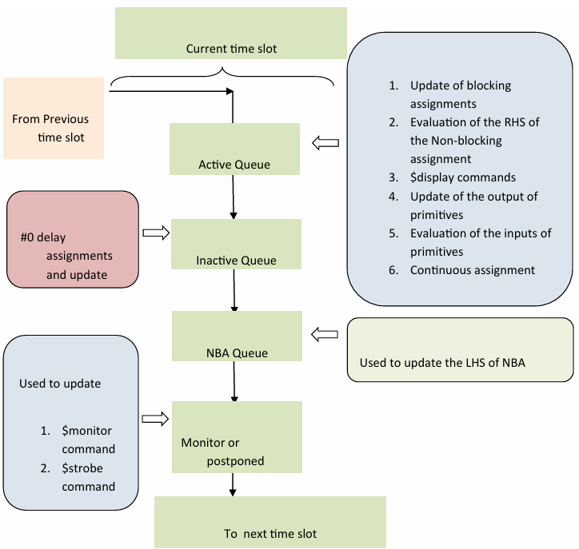
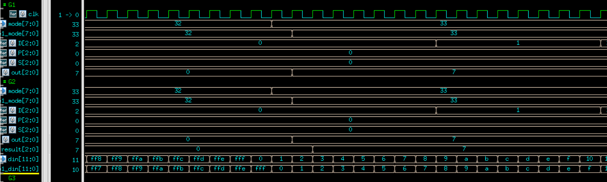

# HW1: Three-input Raster Operations (ROP3) for Computer Graphics

## Testbench(Part2, Part3)
### initial block
Call the task to generate input.
```verilog
//-------------------
// Generate input
//-------------------
integer i, j;
reg first_flag;
initial begin
    din_valid = 0;
    din = 0;
    sel = 0;
    mode = 0;
    first_flag = 0;
    repeat(1) @(posedge clk);
    
    first_flag = 1;
    input_gen(8'h00);
    input_gen(8'h01);
    input_gen(8'h02);
    ...
end
```
Call the task to check the output.
```verilog
//-------------------
// Compare output
//-------------------
reg [63:0] err_cnt;
reg [63:0] pas_cnt;
reg [63:0] pat_cnt;
initial begin
    err_cnt = 0;
    pas_cnt = 0;
    pat_cnt = 0;
    wait(first_flag);
    
    output_check(mode);
    output_check(mode);
    output_check(mode);
    ...
    $finish
end
```

---
### function loopsize()
Used to defined how many iteration we need in loop for complete set of `[4N-1:0]din` input. The loopsize may be $2^{4N}$ for loop(4*`N).
```verilog
function [63:0] loopsize;
    input [63:0] n;
    begin
        loopsize = (64'd1 << n) - 1'b1;  // 2^N
    end
endfunction
```

---
### task inputgen
This task used to input the complete set of `sel` and `din` with specific mode.
```verilog
task input_gen;
    input [7:0] mode_d;
    integer i, j;
    begin
    din_valid <= 0;
    sel <= 0;
    mode <= mode_d;
        for (i = 0; i <= 5'b11111 ; i = i + 1) begin
            for (j = 0; j <= loopsize(4*`N); j = j + 1) begin
                din_valid <= 1;
                din <= din + 1;
                @(posedge clk);
            end
            sel <= sel + 1;
        end
    din_valid <= 0;
    sel <= 0;
    mode_d <= 0;
    end
endtask
```

---
### task outputcheck
This task will check whether the answer comes from LUT and SMART same when the `dout_valid` is high.
```verilog
task output_check;
    input [7:0]mode_display;
    integer i ,j;
    begin
        $display("======================================");
        $display("            check mode: %h            ", mode_display);
        $display("======================================");
        for (i = 0; i <= 5'b11111; i = i + 1) begin
            for (j = 0; j <= loopsize(4*`N); j = j + 1) begin
                // note that X will make while loop jump out.
                while (!(dout_valid_0 === 1'b1 && dout_valid_1 === 1'b1)) begin
                    @(negedge clk);
                end
                if (result_0 === result_1) begin
                  $display("[PASS] LUT = %h, SMART = %h", result_0, result_1);
                  pas_cnt = pas_cnt + 1;
                end else begin
                  $display("[FAIL] LUT = %h, SMART = %h, time = [%0t]", result_0, result_1, $time);
                  err_cnt = err_cnt + 1;
                end
                pat_cnt = pat_cnt + 1;
                @(posedge clk);
            end
        end
    end
endtask;
```

## How to find out all of the 256 boolean function(Part3)
The magic function gave in part2 can be map to the follwing boolean function. The `mode` define the boolean fucntion. The `{P[i],S[i],D[i]}` can be view as the input of boolean function. The `result[i]` can be view as the output of boolean function.
| P[i] | S[i] | D[i] | idx= {P S D}\_2 | result[i] |
|:-:|:-:|:-:|:----------------:|:--------:|
| 0 | 0 | 0 |       000 (0)    |    0 (`mode[0]`)    |
| 0 | 0 | 1 |       001 (1)    |    0 (`mode[1]`)    |
| 0 | 1 | 0 |       010 (2)    |    1 (`mode[2]`)    |
| 0 | 1 | 1 |       011 (3)    |    1 (`mode[3]`)    |
| 1 | 0 | 0 |       100 (4)    |    0 (`mode[4]`)    |
| 1 | 0 | 1 |       101 (5)    |    1 (`mode[5]`)    |
| 1 | 1 | 0 |       110 (6)    |    0 (`mode[6]`)    |
| 1 | 1 | 1 |       111 (7)    |    1 (`mode[7]`)    |

Base on these idea, we can represent the above truth table as sum of minterm form boolean function:
`(~P&S&~D) | (~P&S&D) | (P&~S&D) | (P&S&D)`.

I use the following python code to generate the boolean function:
```python
for mode in range(256):
    terms = []
    for idx in range(8):
        if (mode >> idx) & 1: 
            # choose mode bit-idx
            # mode will define boolean function
            p = "P" if (idx>>2)&1 else "~P"
            s = "S" if (idx>>1)&1 else "~S"
            d = "D" if (idx>>0)&1 else "~D"
            terms.append(f"({p}&{s}&{d})")
    if not terms:
        expr = "0"
    else:
        expr = " | ".join(terms)
    print(f"    8'h{mode:02X}: out = {expr};")
```


## What I learn from this HW.
In the design module, there is a pipeline stage for `mode`, called `stage1_mode`.
```verilog
always @(posedge clk) begin
  stage1_din_valid <= din_valid;
  stage1_din <= din;
  stage1_sel <= sel;
  stage1_mode <= mode;
end
```
At beginning, I expect the `stage1_mode` will delay 1 cycle than `mode`. However, the simulation waveform is shown as below. The `stage1_mode` and `mode` is "synchronous".


---
The reason comes from the Verilog stratified event queue.

For example:
```verilog
always @(posedge clk) begin
    mode = newmode;
    stage1_mode <= mode;
end
```
Since blocking assignments will be execute first, the code will looks like:
```verilog
always @(posedge clk) begin
    mode = newmode
    stage1_mode <= newmode;
end
```
We dont want this behavior, the behavior we want is that the `stage1_mode` delay update ` cycle than `mode`.

---
Now look at testbench, all of the assignment use blocking assignment. So this problem occurs.
```verilog
task input_gen;
    input [7:0] mode_d;
    integer i, j;
    begin
    din_valid = 0;
    sel = 0;
    mode = mode_d;
        for (i = 0; i <= 5'b11111 ; i = i + 1) begin
            for (j = 0; j <= loopsize(4*`N); j = j + 1) begin
                din_valid = 1;
                din = din + 1;
                @(posedge clk);
            end
            sel = sel + 1;
        end
    din_valid = 0;
    sel = 0;
    mode_d = 0;
    end
endtask
```
---
To fix that problem, the testbench should be written as:
```verilog
task input_gen;
    input [7:0] mode_d;
    integer i, j;
    begin
    din_valid <= 0;
    sel <= 0;
    mode <= mode_d;
        for (i = 0; i <= 5'b11111 ; i = i + 1) begin
            for (j = 0; j <= loopsize(4*`N); j = j + 1) begin
                din_valid <= 1;
                din <= din + 1;
                @(posedge clk);
            end
            sel <= sel + 1;
        end
    din_valid <= 0;
    sel <= 0;
    mode_d <= 0;
    end
endtask
```

