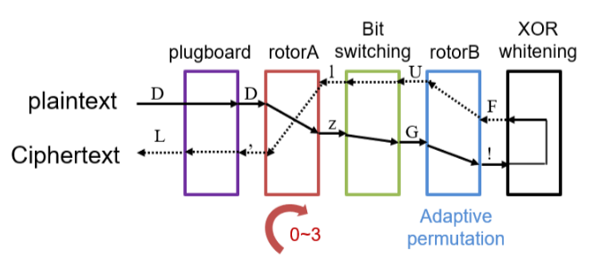
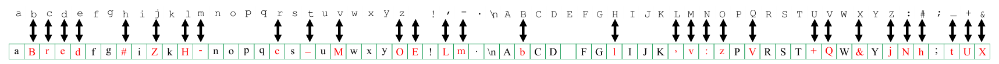
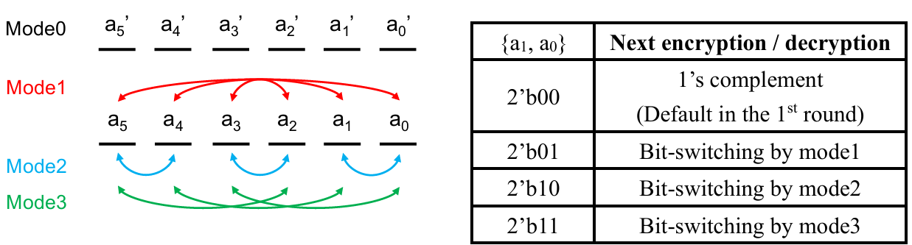
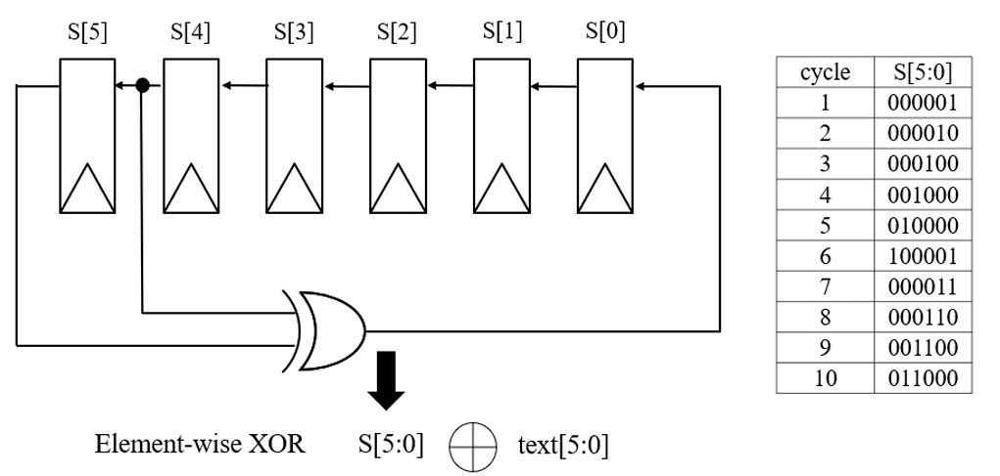
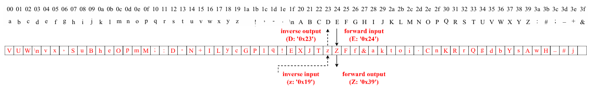
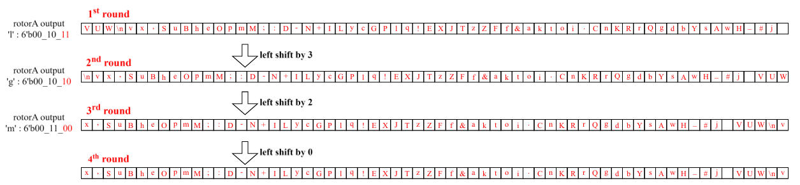
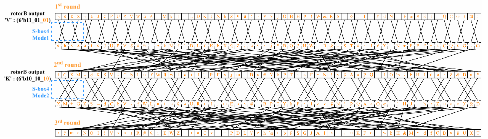
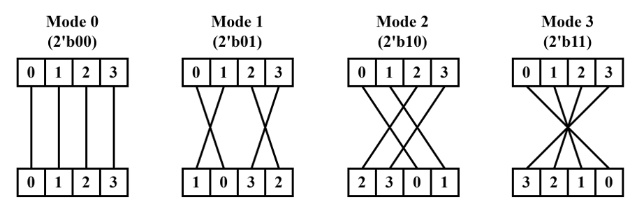
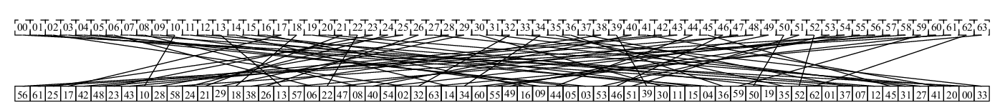

# HW2: Enigma
Enigma is the electro-mechanical rotor cipher machine used by the German military in World 
War II. 

As shown in figure, Enigma generates one **6-bit** ciphertext from one **6-bit** input plaintext. A 
plaintext(明文) goes through the plugboard, the rotors, the bit-switching box, and the XOR whitening. Then, 
it reverses the path, passing through the same components to become a ciphertext(密文).

## 1. plugboard
The plugboard provides additional security to Enigma. A connection on the plugboard swaps 
two symbols. For example, **if ‘E’ and ‘O’ are connected, so the plugboard outputs ‘O’ if the input 
is ‘E’, and vice versa**. If a symbol is not plugged, the plugboard outputs the same symbol. Note that 
the configuration of the plugboard changes daily to make the ciphertext harder to crack in the real 
world. 

In this assignment, there are 16 connections in the plugboard, so 32 symbols are plugged and 32 
symbols are not plugged. One example of the plugboard is shown in figure. **The configuration of the 
plugboard is loaded before encryption or decryption**.

## 2.  Bit-switching box 
The bit-switching box uses four modes for encryption/decryption. When the first text(6-bit) enters the Enigma, it defaults to  ode 0.

The mode for the next text is determined based on either **output of 
the forward process during encryption** or **input of the inverse process during decryption**. For 
bit switching operations in different modes, please refer to figure.

Note that both encryption and decryption have forward and inverse process.

Assuming a 6-bit output {a5, a4, a3, a2, a1, a0} is obtained during encryption, the mode for the 
next bit-switching box operation is determined by the last two bits {a1, a0}. For example, if 'Z' = 
0x39, which is represented as 6'b11 10 01 in binary, the least significant 2-bits are 2’b01. This 
indicates that the bit-switching box should be switched to  ode 1 before the next encryption. 

## 3. XOR-whitening
Initially, the state registers are **reset as 6’b000_001** when `srst_n` is low. During encryption or 
decryption, input text is XORed element-wise with current state  [5:0]. After this XOR operation, 
state registers shift left:  [1]<- [0], …,  [5]<- [4] and  [0] is updated with feedback bit. Note that 
the registers shift left only when input text is **XORed with current state**.

## 4. Rotor A
A rotor, or a plugboard is essentially a mapping mechanism that maps a 6-bit input to a 6-bit 
output. As shown in figure, rotorA maps ‘E’ into ‘Z’ in the forward pass (solid line), and maps ‘z’ 
into ‘D’ in the inverse pass (dashed line). An example of rotorA is shown in figure. In the **forward pass**, the **input** is an **entry of rotorA** (E: ‘0x24’), and the **output** is the **symbol of that entry** (Z: ‘0x39’). 
In the **inverse pass**, the **input** is a **symbol** (z: ‘0x19’), and the **output** is the **address of the entry** that 
contains the symbol (D: ‘0x23’).

The rotorA rotates after Enigma encrypts or decrypts one text. RotorA shifts 0~3 symbols after encrypting one symbol (one forward pass and one inverse pass). In the encryption 
mode, the amount of rotation is the least significant 2-bit of the output of the forward pass, as the following figure. In the 
decryption mode, the amount of rotation is the least significant 2-bit of the input of the inverse pass.

## 5. Rotor B
The Rotor mapped the input to output. In the forward pass, input address and output symbol. In the reverse pass, input symbol and output address.

As Rotor A,  the rotor B **permutes after Enigma encrypts or decrypts one text**. Rotor B first 
goes through the S-box4 that permutes every four contiguous symbols. Then it goes through a 
**fixed permutation**(Two stage permutation).

### stage 1
There are four permutation modes for the S-box4 as shown in figure. In the encryption mode, 
the permutation mode is the least significant 2-bit of the output of the forward pass. In the 
decryption mode, the permutation mode is the least significant 2-bit of the input of the inverse pass.

### stage 2
After the S-box4, rotor permutes according to a fixed connection. The detailed connection is shown 
in figure. 
