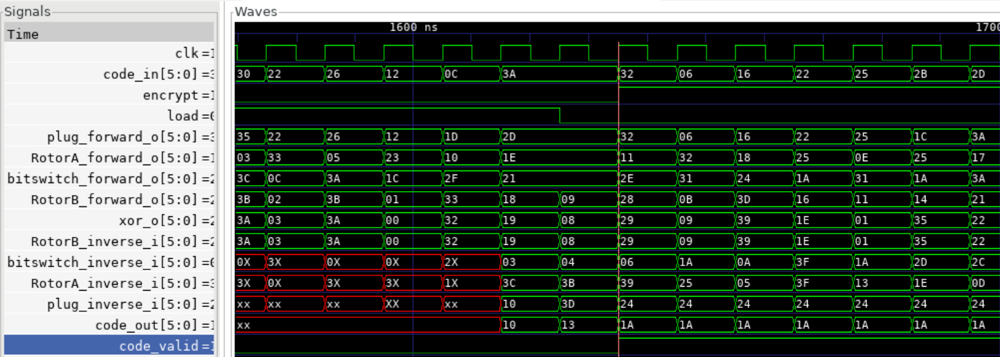

# HW3: Logic synthesis for rop3 and enigma

## Performance
Rank: 23 / 76
| Area | Timing | Performance |
| ---- | ------ | ----------- |
| 14883.15 | 3.55 | 52835 |


## Synthesis skills
### 1. synopsys parallel case
If we use MUX in our design by case, remember to use synopsys parallel case, this would reduce the datapath timing when synthesis.

```verilog
// 1. original 
    assign reg_i[k] =
        ({load_reg, plug_forward_valid} == 2'b01) ? shift_mux[k] :
        ({load_reg, plug_forward_valid} == 2'b10) ? shift_i[k]   :
                                                    link[k];
// 2. parallel case
	always @(*) begin
		case ({load_reg, plug_forward_valid}) // synopsys parallel_case
		2'b01: begin
		  reg_i[k] = shift_mux[k];
		end
		2'b10: begin
		  reg_i[k] = shift_i[k];
		end
		default: begin
		  reg_i[k] = link[k];
		end	
		endcase
	end
```

```verilog
// 1. original
assign RotorA_forward_o = link[plug_forward_o_reg];
// 2. parallel case
always @(*) begin : RotorA_MUX
    case (plug_forward_o_reg) // synopsys parallel_case 
        6'd0 : RotorA_forward_o = link[0];
        6'd1 : RotorA_forward_o = link[1];
        6'd2 : RotorA_forward_o = link[2];
        6'd3 : RotorA_forward_o = link[3];
        6'd4 : RotorA_forward_o = link[4];
        6'd5 : RotorA_forward_o = link[5];
        6'd6 : RotorA_forward_o = link[6];
        6'd7 : RotorA_forward_o = link[7];
        ...
        6'd60: RotorA_forward_o = link[60];
        6'd61: RotorA_forward_o = link[61];
        6'd62: RotorA_forward_o = link[62];
        6'd63: RotorA_forward_o = link[63];
    endcase
end
```
### 2. module flatten
Faltten the module into the top module will reduce many area. (~20%)

### 3. Adder
Use mux-based adder(-0.1ns) or carry look ahead adder(-0.1ns) to improve timing. 

### 4. srst
Don't add pipeline register for rst, load, table_idx, the synthesis will view it as mux-FF.
```verilog
// rst FF
always @(posedge clk) begin
  if (!srst_n) begin
    RotorA_addr_shift <= 0;
  end else if (plug_forward_valid) begin
    RotorA_addr_shift <= RotorA_addr_shift_next;
  end 
end

// mux based FF (worse timing)
always @(posedge clk) begin
  if (!srst_n_reg) begin
    RotorA_addr_shift <= 0;
  end else if (plug_forward_valid) begin
    RotorA_addr_shift <= RotorA_addr_shift_next;
  end 
end
```

### 5. Equal
Dont write `==`, write same logic my `~|(^)`.
```verilog
genvar j;
generate
	for (j = 0; j < pRotorA_LEN; j = j + 1) begin : GEN_MATCH
	  assign bitwise_and_o[j] = ~|(RotorA_inverse_i_reg ^ link[j]);
	end
endgenerate

// timing slow 0.01ns
genvar j;
generate
	for (j = 0; j < pRotorA_LEN; j = j + 1) begin : GEN_MATCH
	  assign bitwise_and_o[j] = (RotorA_inverse_i_reg == link[j]);
	end
endgenerate
```

## waveform
### 1. pure combinational 


## Fast Synthesis Method
```shell
# Multi-core for fast synthesis
set CORES 16
set_host_options -max_cores $CORES
report_host_options

# Set your TOPLEVEL here
set TOPLEVEL "enigma"

# Change your timing constraint here
set TEST_CYCLE 3.3

source -echo -verbose 0_readfile.tcl 
source -echo -verbose 1_setting.tcl 
source -echo -verbose 2_compile.tcl 
source -echo -verbose 3_report.tcl 

exit
```
