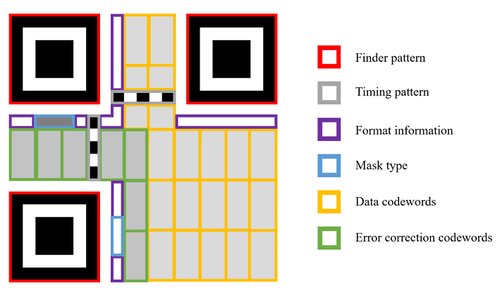
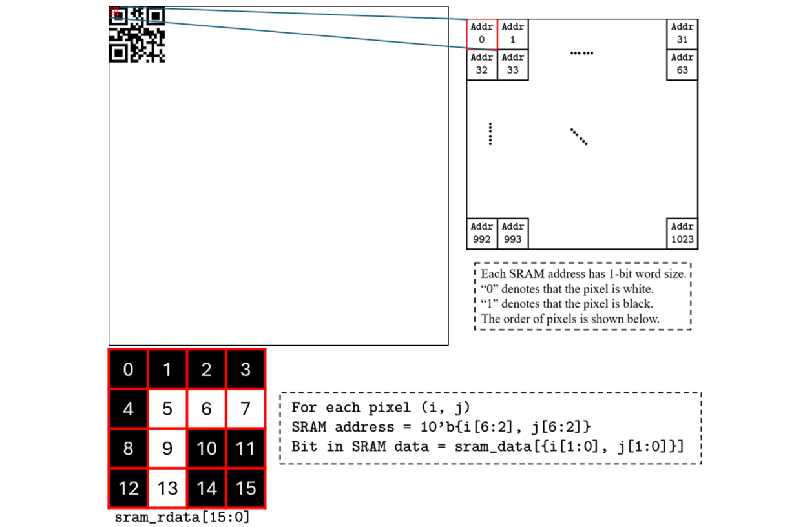
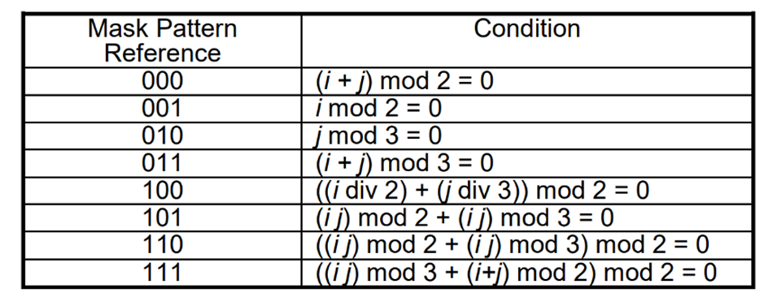
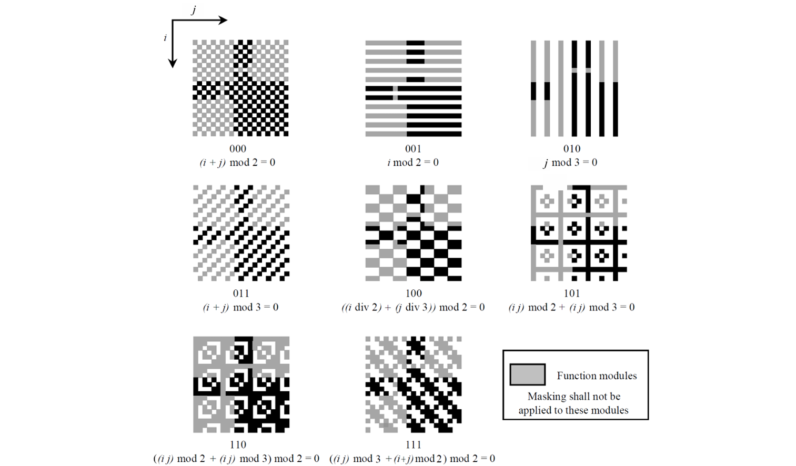
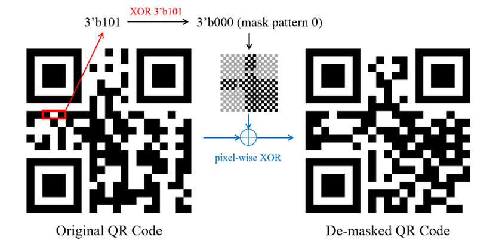
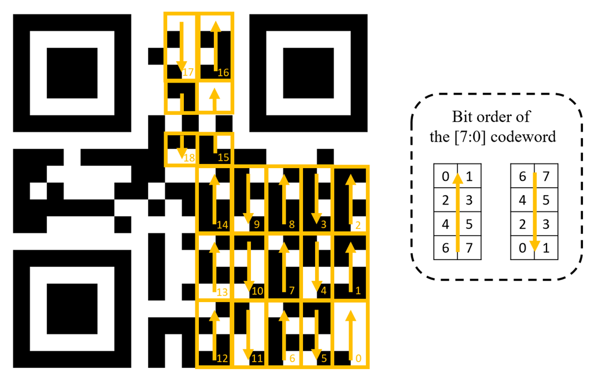
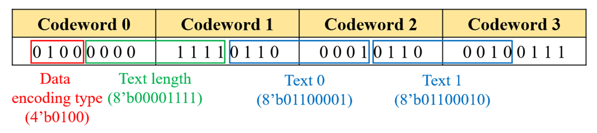
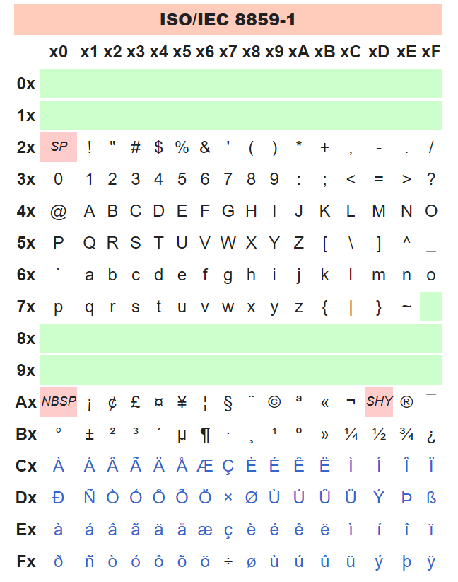

# HW4: QRCODE

## Introduction
QR Code (Quick Response Code) is a type of matrix barcode used for storing 
text information in a robust way. 

 The version 1-L QR Code is a 21x21 
binary matrix, in which the black pixel stands for “1”, and white for “0”. The codewords 
of a QR Code are “masked” (XORed) with one pre-defined pattern for balancing the 
number of black and white pixels. As a result, you need to find the mask pattern ID for 
de-masking the codewords. After de-masking, the codewords can be decoded 
sequentially. 




## Details


### 1. Data arrangement in SRAM

In this homework, we implement the smallest version **21x21 pixel QRcode(or scale by 2, 42x42 pixe;)**.

 QRcode pattern are put into an 128x129 image. The **whole 128x128 image is stored in SRAM**. The data 
arrangement is illustrated in Figure. The SRAM has a capacity of 1024 words and 
a **16-bit word size(16 bit per word)**. Each address contains 16 pixels, arranged in the order shown 
in Figure. 



### 2. Rotation of the QR Code 

For Rank A, Rank B and Rank C, the QR Codes are at arbitrary location with 
arbitrary rotation (0°,90°,180°,270°). You need to locate the QR Codes and 
determine their rotation **before decoding** it. The rotation of the QR Codes depend 
on the location of the three **finder patterns**.

### 3. Location of the QR code

For Rank A and Rank B, the number of QR Code in a test pattern might be 
more than one. Therefore, we use two output ports:`[6:0] loc_y` and `[6:0] loc_x` to 
**specify which QR Code** in the test pattern does the output `[7:0] decode_text`
belongs to. 

### 4. Demasking

All the codewords in the QR Code are masked (XORed) with a specific mask 
pattern, and the mask pattern is decided by the mask pattern ID. 

The ID is a 3-bit data(**Mask Type**), which locates in position {(8, 2), (8, 3), (8, 4)} in the QR Code with rotation 
0°. **The 3-bit data should first be XORed with a fixed 3'b101 to derive the real 
mask ID**. There are total 8 different mask patterns. The pixel of the mask pattern 
is equal to **"1(black)"** if it satisfies the corresponding condition in table.



You can refer to Figure for what each mask pattern should look like. 



An example of the de-masking 
process is provided in Figure.



### 5. Decode the data codewords

After demasking, you can read data codewords from the de-masked QR Code. 
The arrangement of each data codeword and its bit order is shown in Figure. 
Decode the codewords by the order of number labelled in each block. 

You need to identify the 8-bit codeword depend on the arrow direction.



### 6. Decode the text

The data in data codewords is arranged as shown in Figure. The first four 
bits in codeword 0 is data encoding type. **We only use 8-bit Byte mode (4'b0100) 
in this assignment, you can refer to ISO 8859-1 code to see the value of each 
character**. 

The last four bits of codeword 0 and the first four bits of codeword 1 
indicates the **text length** encoded in this QR Code. You should first determine the 
text length to **decide how many characters should be decoded**. 

For the rest of the data codewords, the last 4 bits of the current codeword and the first four bits of the 
next codeword will form a text data. Once decoding a text data, you can put it to 
the output port `[7:0] decode_text` and set the output port `valid` to high. The 
testbench will check the output text when the output valid is high. 





### 7. Testbench

```verilog
`define golden_num_filepath "./golden/golden_num_rank_A.dat"    // number of qrcode in this pattern
`define golden_len_filepath "./golden/golden_length_rank_A.dat" // text length of qrcode
`define golden_loc_filepath "./golden/golden_loc_rank_A.dat"    // identify which qrcode
`define golden_text_filepath "./golden/golden_text_rank_A.dat"  // identify the text in qrcode
```

### 8. Summary

Workflow:
Specify the qrcode(location and rotation) -> Demask the qrcode -> Decode the data