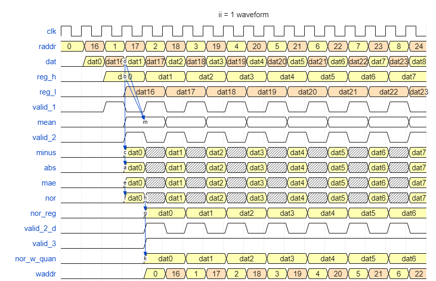

# HW5: Vision Transformer

## Introduction
Vision Transformers (ViTs) have emerged as a powerful alternative to traditional 
convolutional approaches for computer vision tasks. The pioneering work on ViT 
demonstrated that, with sufficient data and computational resources, transformer-based 
models can achieve state-of-the-art performance on image classification tasks, opening the 
door to a new era of vision architecture beyond CNNs. 
In this assignment, we will implement a multi-head attention of a transformer block. 
The implementation will also include linear projection, softmax and normalization 
operations. 

## Dataflow
1. Read the patch embedded data from SRAM A. 
2. Implement normalization. 
3. Quantize the result to 10-bit and write the result to SRAM B. 

4. Read normalized data from SRAM B. 
5. Implement head 0 of K projection, Q projection and V projection. 
6. Quantize the result to 10-bit and write the result to SRAM C. 

7. Read K projection and Q projection from SRAM C. 
8. Implement multiplication of attention head 0 first 16 rows results. 
9. Multiply each result with 1/$\sqrt{chead}$
10. Quantize the result to 10-bits and write the result to SRAM D. 

11. Read the attention data form SRAM D. 
12. Implement Softmax. 
13. Quantize the result to 10-bits and write the result to SRAM B.

14. Read V projection from SRAM C and softmax result from SRAM B. 
15. Implement multiplication of attention head 0 first 16 rows results. 
16. Quantize the result to 10-bits and write the result to SRAM D. 

17. Repeat step 7~15 to finish remaining rows. 
18. Repeat step 1~16 to finish head1. 

19. Read V softmax multiplication result from SRAM D. 
20. Implement O projection. 
21. Quantize the result to 10-bit and write the result to SRAM C. 

22. Read O projection from SRAM C and patch embedded data from SRAM A. 
23. Implement residual add 
24. Quantize the result to 10-bit and store the result to SRAM B. 

## SRAM Mapping
Each SRAM A, B, C, D have 4 bank. To enable 
parallel access, four banks are interleaved, allowing four addresses to be sent to four banks 
simultaneously.


|SRAM|A|B|C|D|
|-|-|-|-|-|
|addr width|32|32|48|64|
|data width|80|80|80|80|

Since each chennel of token(a element of matrix) is 10 bits, so one address data(80 bits) can hold 8 channel of tokens. By accessing all four banks in parallel, the system can read or write a 
2×2@8ch token in a single cycle.


With the concept of SRAM group, now, we address the details of how we store output 
feature maps of each layer to the SRAM group by mapping the feature maps to specific 
addresses. 

Since the SRAM group can only store 8 channels in one address, layers with a 
larger number of channels, they need to partition their feature maps along channel 
dimensions and store them in different addresses. 

For the Q, K, and V projections, consider 1 head, the size of Q, K, and V is 8x8@8ch = 64x8 element. So the  results are stored in SRAM Group C: addresses 0~15 for Q, 16~31 for K, and 32~48 for V.

For example, addresses 0~15 can store 16x8 element, and consider 4 bank, there is 64x8 element(64@8ch)


Since the attention layer output shape is 64*64(larger them out SRAM group), we should 
separate them by chunks and calculate sequentially. More details will be mentioned in the 
Mutli-head self-attention implementation Section. 


## Layernorm Optimization
### ii = 1 version


|resource|area| timing |
|--|-|-|
|adder|||
|multiplier(10*10=20bit)|0.7k|<3ns|
|divider(24/18=10bit)|6.5k|9.6ns|
|DW_pipe_4(24/18=10bit)|7.7k|<3ns|

- calculate mean use 64 adder in 1 cycle.    
- calculate minus use 64 subtractor in 1 cycle.
- calculate abs use 64 adder in 1 cycle.
- calculate mae use 64 adder in 1 cycle.
- calculate nor use 64 divider in 1 cycle.
- calculate nor_weight use 64 multiplier in 1 cycle,

Totally use 32 cycle in Layernorm.

To optimize the resouce using, we may increase ii to 8, so the resource using may reduce.

## DesignWare
```shell
# open DW
[u110022124@ws41 doc]$ dc_shell
# 找 PDF
[u110022124@ws41 doc]$ sh find $env(DW_ROOT) -maxdepth 6 -iname
# 看完路徑後，離開DW
[u110022124@ws41 doc]$ exit
# 進去剛剛查看到的路徑
[u110022124@ws41 doc]$ cd /usr/cad/synopsys/synthesis/cur/dw/doc/
# 用指令下載整包說明文件
[u110022124@ws41 doc]$ tar czf ~/dw_dwdoc.tar.gz datasheets manuals
[u110022124@ws41 doc]$ cd ~
[u110022124@ws41 ~]$ ls dw_dwdoc.tar.gz
dw_dwdoc.tar.gz
[u110022124@ws41 ~]$ echo $HOME
/home/u110/u110022124
[u110022124@ws41 ~]$ cd ~
[u110022124@ws41 ~]$ pwd
/home/u110/u110022124

```
pwd 回傳目前所在位置