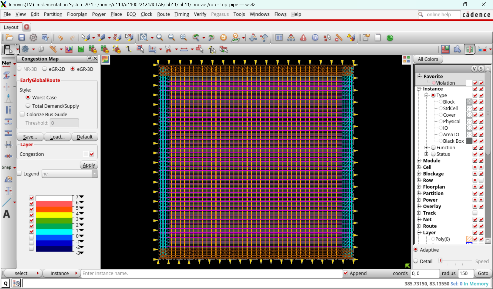
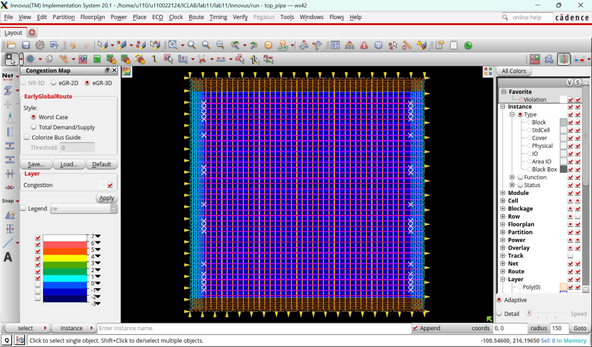
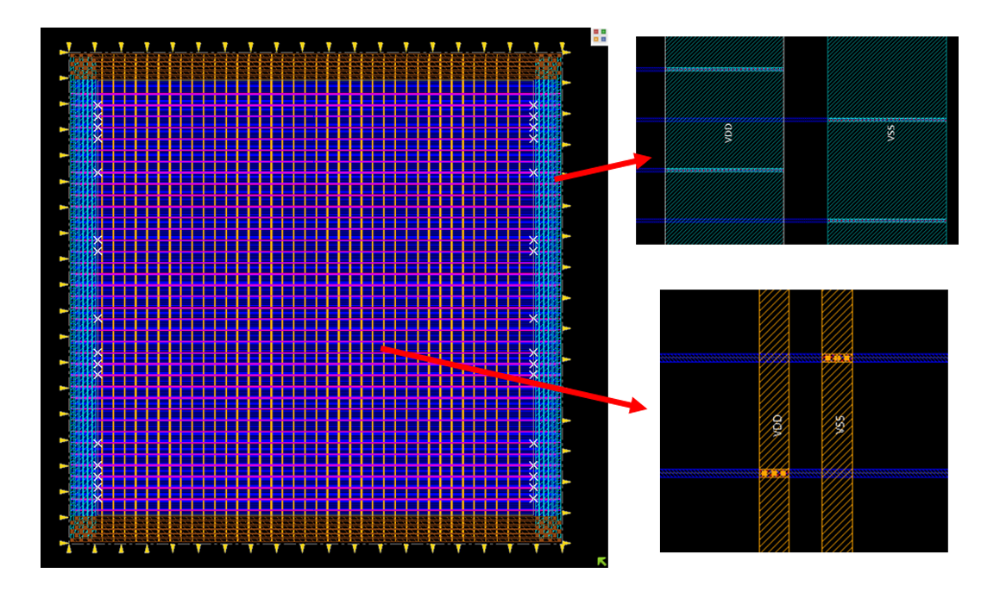
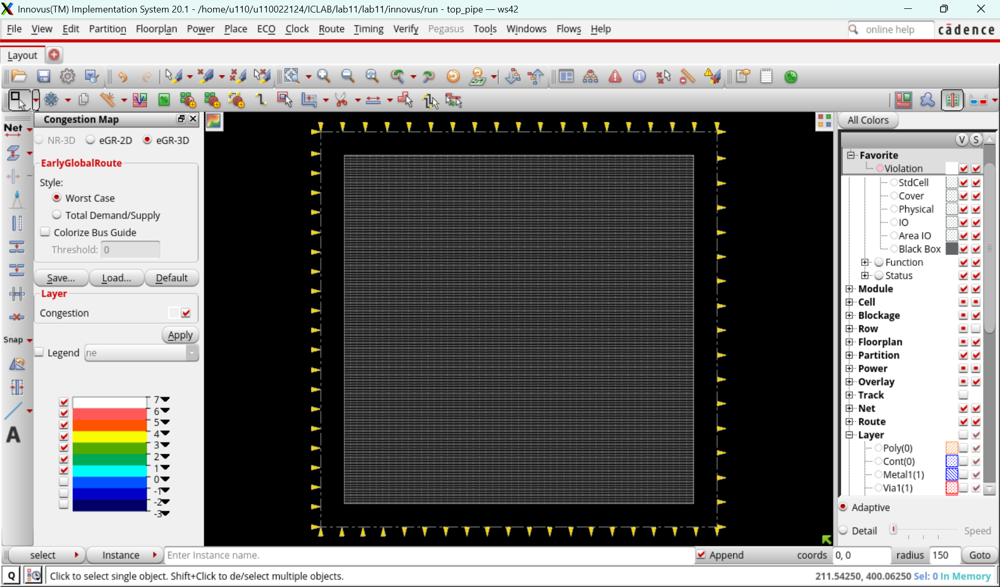
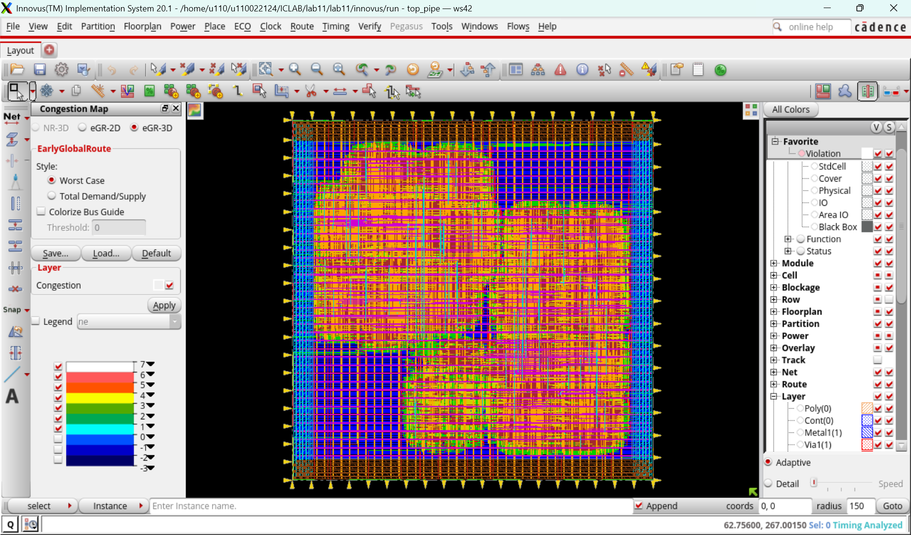
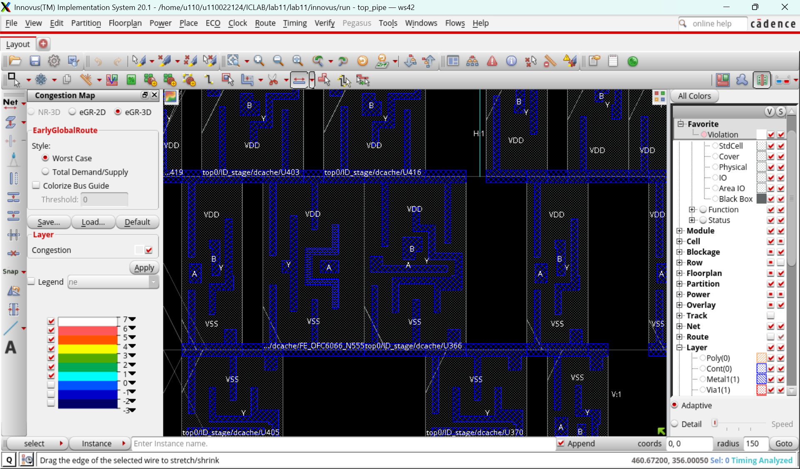
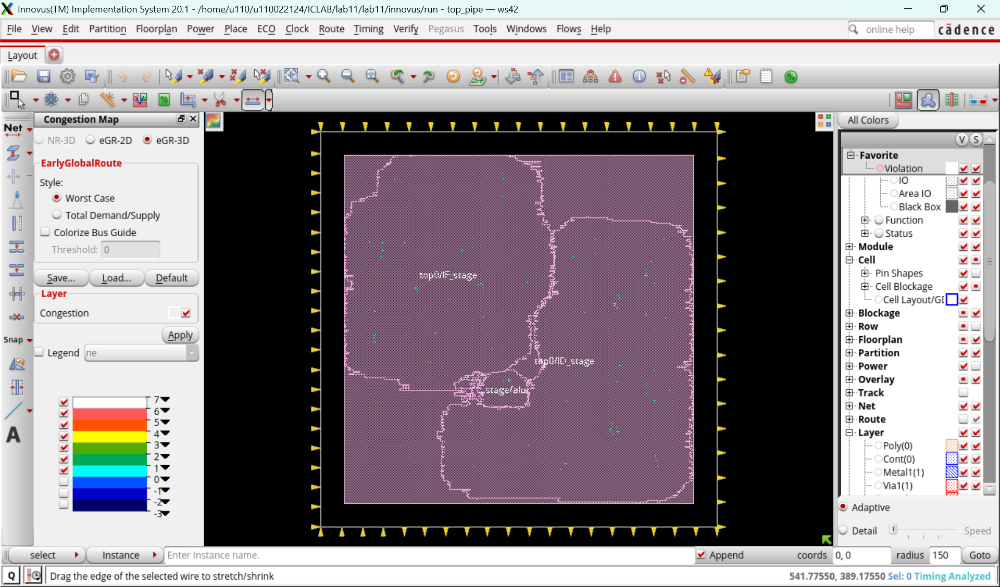
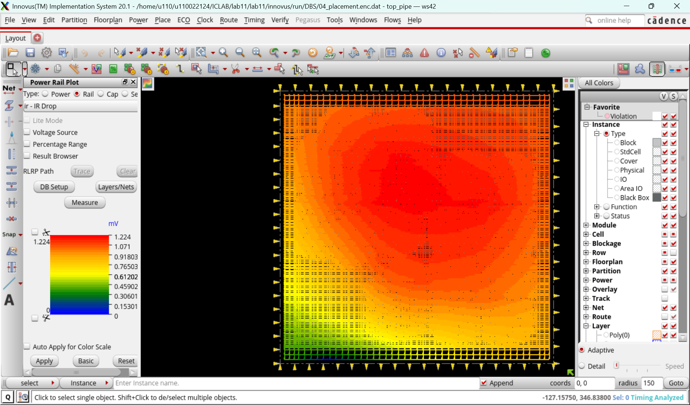

# Lab12: APR Flow with Innovus – Powerplan and Placement

## Related file
The related file is all in lab11.

## 1. Add power ring and power stripe

### Power Ring
The power ring forms the outer backbone of the chip’s power delivery network.
It provides a low-resistance path around the core so VDD/VSS can enter from multiple sides, stabilizing the global supply before distributing power inward.

## 2. Connect follow pin
In a standard-cell ASIC design, a power rail refers to the horizontal metal segments (typically on Metal 1) that run across every standard-cell row and deliver VDD and VSS to each cell.

Each row contains:
- A VDD rail at the top of the row
- A VSS rail at the bottom of the row

These rails are part of the physical layout of every standard cell. The cells expose pins on these rails so that the APR tool can connect them to the chip’s global power network.

### Why we need power rails

Power rails act as the local distribution layer for power:

The power ring brings supply from the chip boundary.

Power stripes distribute that power deeper into the core.

Follow-pin special routing then **connects the stripes to each row’s power rails**.

Finally, standard cells draw their VDD/VSS from these rails.

Without the power rails, the cells would not have a consistent, predictable, and DRC-clean way to connect to VDD/VSS.

## 3. Create path group

### What it does
createBasicPathGroups -expanded divides timing paths into groups such as input, output, and reg-to-reg.

### Why
Each path group can be optimized differently. It also makes timing reporting clearer.

## 4. Add tap cell

### What it does
`addWellTap -cell FILL4 -cellInterval 20 -checkerBoard` inserts tap cells.

### Why
Tap cells tie N-well to VDD and P-substrate to VSS, preventing latch-up.
The process requires a tap within a certain distance.
Lab uses FILL4 as a simplified substitute.

## 5. Run placement

### What it does
Runs `setPlaceMode -reset` and then `place_opt_design`.
This is Innovus’s main detailed placement + pre-CTS timing optimization step.

It performs:
- Cell placement within the floorplan
- Cell sizing
- Buffer insertion
- Local movement
- Setup-timing & congestion optimization

### Why
This is where most setup violations and congestion must be fixed.
After CTS/routing, the tool has far less freedom to rearrange cells.

## 6. ECO optimize design
### What it does
If timing still fails, you can use “ECO → Optimize Design…” to run extra optimization.

## 7. Add Tie HI/LO cells
### What it does
“Place → Tie HI/LO Cell → Add…” inserts tie-high and tie-low cells so nets connected to 1’b1/1’b0 are driven through tie cells.

### Why not connect gates directly to VDD/VSS?
Direct connections stress the thin gate oxide with full rail voltage, creating ESD and reliability risk.
Tie cells contain protective structures and generate stable logic levels safely.

## 8. Physical / FRAM View & Hierarchy View
### What it shows
How standard cells obtain power from the rails, and how hierarchy blocks are partitioned.

## 9. Static power analysis

### 9-1. Gate simulation
#### What it does
Run `vcs -R -f gatesim.f` to produce VCD/FSDB waveform.

#### Why
Static power analysis needs toggle rate for every net.
Without waveform, the tool must assume switching probabilities, which is inaccurate.

### 9-2. Power Analysis (Setup & Run)

Provides a power estimate at the placement stage.
More accurate power will be obtained later at post-route or signoff.

#### What it does
“Power → Power Analysis → Setup…” then Run.
Innovus uses:

Power tables in the .lib

Waveform-based switching activity

to calculate internal/switching/leakage power.

|Total internal power| Total switching power | Total leakage power| Total power|
|-|-|-|-|
|2.3913 mW|0.5908 mW |0.0161 mW|2.9984 mW|

### 9-3. Rail Analysis (IR Drop)
#### What it does
“Power → Rail Analysis → Setup…” then Run.
Specifies extraction techfile, VDD/VSS nets, and current waveform.

#### Why
$\text{IR drop} = I\times R$

$V_{DD,local}=V_{DD}-IR$

Long/thin metal causes voltage drop.
If local VDD droops too much:

- Logic slows down
- Timing fails

In extreme cases, logic malfunctions

Color map shows the worst-drop areas.

