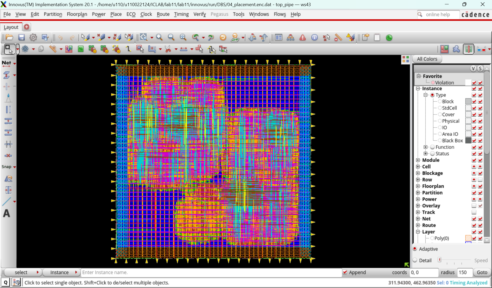
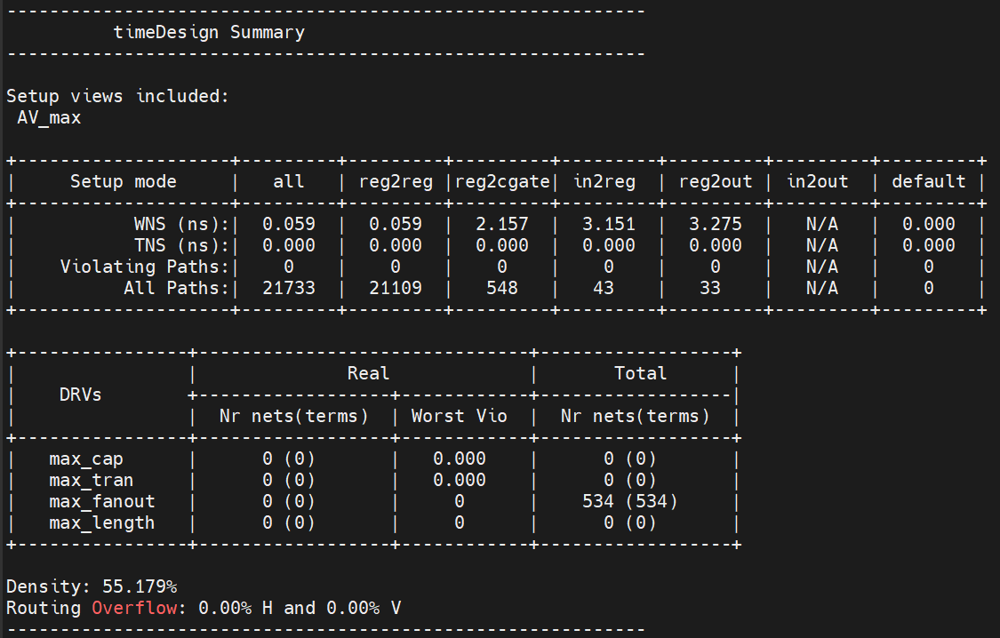
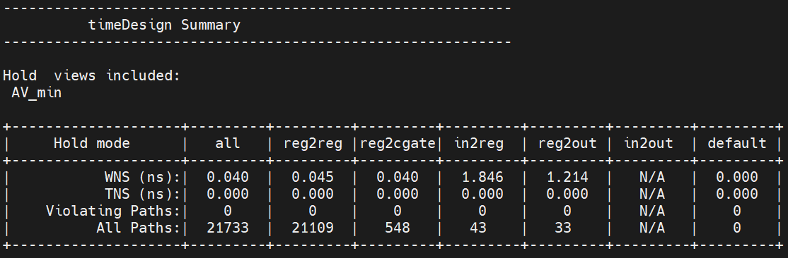
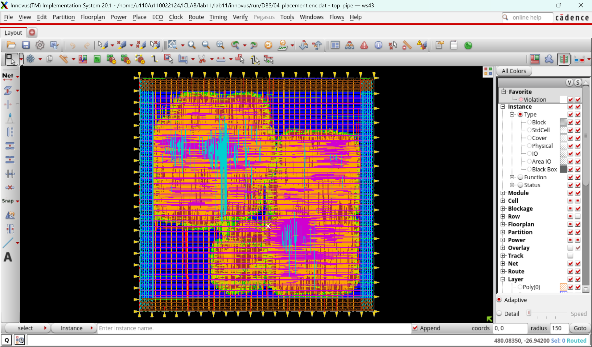
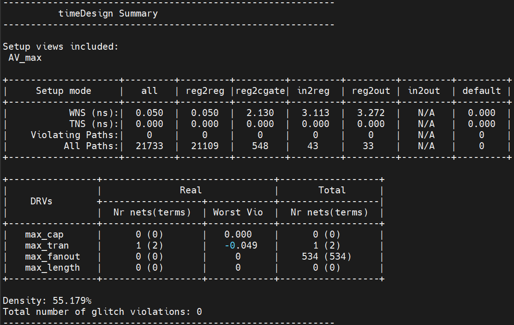
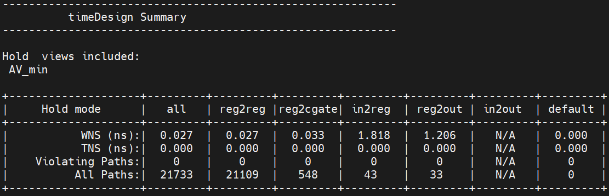
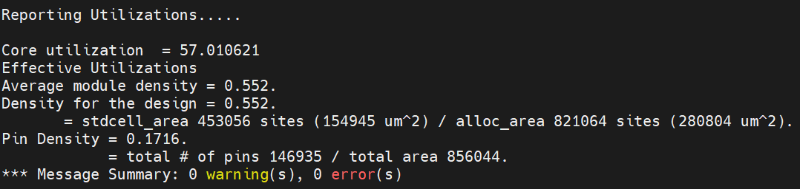
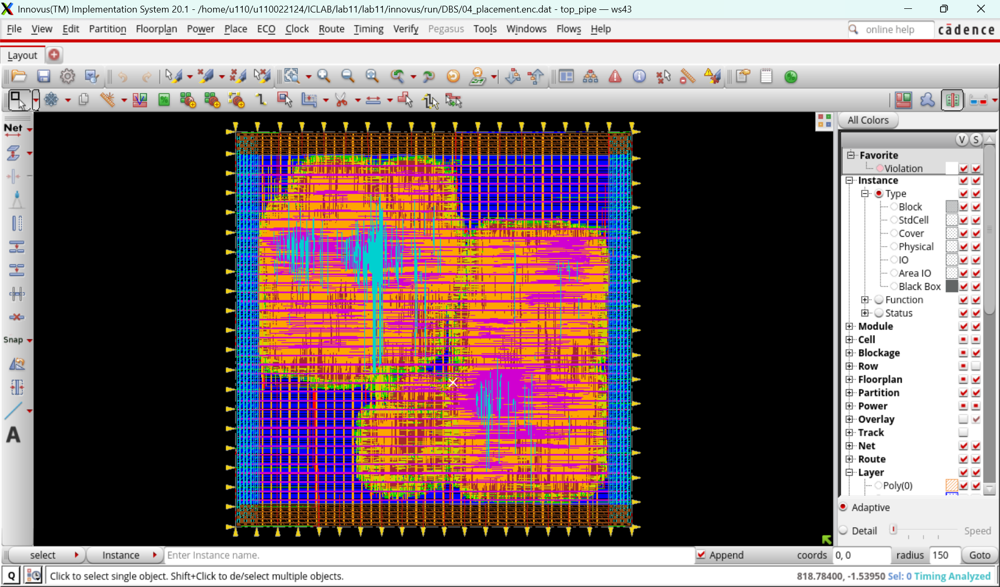
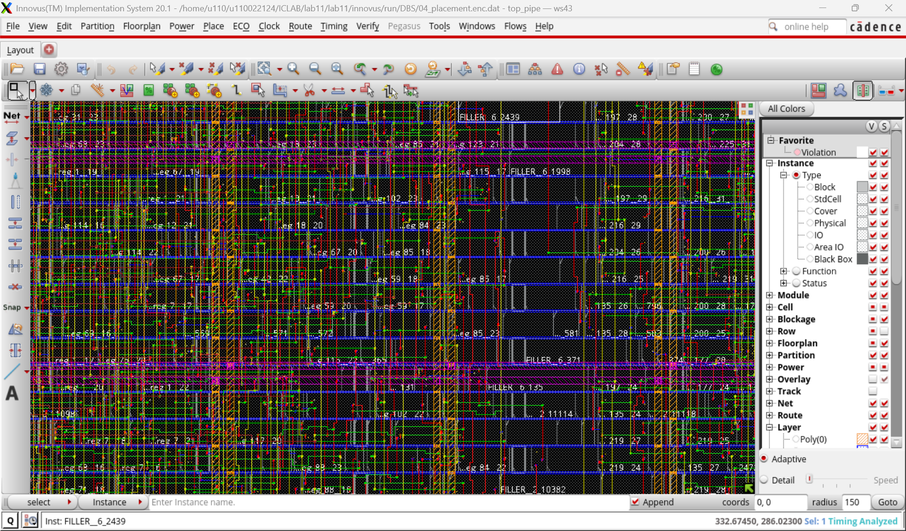

# Lab13: CTS、Routing、Verification、Power Analysis

The resource is in the Lab11.

## 1. CTS


### 1-1. Remove Clock Latency Constraints
#### What it :
```shell
set_interactive_constraint_modes [all_constraint_modes]
reset_clock_latency [all_clocks]
```

#### Why:
Before CTS, clock latency is assumed to be zero.
After CTS, the real clock arrival times will replace these ideal assumptions.

#### Role:
Ensures the tool does not mix ideal and propagated latencies when building the clock tree.

### 1-2. Run CTS

#### What it does:
Execute the CTS script (ccopt.cmd) to automatically build the clock tree.

#### Why:
CTS eliminates ideal clocks and inserts buffers/inverters to balance clock delay across all flip-flops.

#### Role in APR:
This is the transition from an ideal clock domain to a physical clock distribution network.
It directly affects both setup and hold timing.

### Setup Time check after CTS


Meaning:
Ensures the data arrives early enough before the capturing clock edge.

Why now:
Clock skew and latency are now real, so setup timing is meaningful for the first time.

### Hold Time check after CTS


Meaning:
Ensures data does not arrive too early after the clock edge.

Why now:
Newly inserted clock buffers can introduce skew that may break hold timing.

Role:
Hold timing must be clean before routing, otherwise routing will struggle to fix it.

## 2. Route



#### What it does:
Perform global + detailed routing for all signal nets.

#### Why:
Turns the logical connections into physical wires across the metal layers.

#### Role in APR:
Routing finalizes wire delays, coupling capacitance, and path topology—true post-route timing is only available after this step.

### 2-1. Post-Route Timing Checks

What it does:
Change to extraction-based analysis (RC-aware).

Role:
Uses real parasitics instead of estimates.

### 2-2. Enable SI-aware Timing
```shell
Enable SI-aware Timing
```
#### Why:
Coupling noise affects timing significantly in deep submicron nodes.

#### Role:
Ensures accurate setup/hold analysis after routing.

### 2-3. Setup Time check after Route
Repeat timing checks with full post-route extraction.



#### Why:
Routing often adds large delays → setup may fail.


#### Role:
This is the final timing closure stage before verification.

### 2-4. Hold Time check after Route
Repeat timing checks with full post-route extraction.



#### Why:
Routing also shortens some nets → hold may fail.

#### Role:
This is the final timing closure stage before verification.

### 2-5. ECO optimization

#### What it does:
Perform post-route ECO (buffer insert/remove, resizing paths).

#### Role:
Last chance to fix timing before signoff.

### 2-6. Check Core Utilization



```shell
checkFPlan -reportUtil
```
#### Why:
Confirms that routing congestion did not force excessive spreading or compaction.

### 2-7. Verification

#### DRC
```shell
verify_drc
```
##### Why:
Detect width/spacing/area violations after routing.

#### Connectivity

##### What it does:
Verify connectivity consistency between layout and netlist.

##### Why:
Find opens/shorts introduced during routing or ECO steps.

#### Antenna

##### What it does:
Detect antenna violations caused by long unconnected wires during fabrication.

##### Why:
Protects transistor gates from oxide damage.


## 3. DFM




#### What it does:
Insert filler cells into gaps between standard cells.

#### Why:
Maintains well continuity and poly density.
Avoids DRC issues such as well breaks and mismatched diffusion.

#### Role:
Required in all real ASIC flows before tapeout.

## 4. Export Design

### 4-1. Export Netlist + SDF
#### Why:
SDF contains actual post-route delays (gate + interconnect).
Needed for post-layout simulation.

### 4-2. Export GDS
#### Why: 
GDS is the final physical layout used for tape-out.

### 4-3. Export Constraints + Parasitics (SDC + SPEF)

#### What it does:
```shell
write_sdc CHIP_layout.sdc
setExtractRCMode -engine postRoute
reset_parasitics
extractRC
rcOut -rc_corner RC -spef CHIP_layout.gz
```

#### Why:

- SDC describes timing constraints for PrimeTime

- SPEF contains post-route parasitic R/C values

#### Role:
These files are required inputs for accurate **PrimeTime power analysis**.

## 5. Post-Layout Simulation

#### What it does:
Run VCS with:

post-layout netlist
```shell
# postsim.f
../innovus/post_layout/CHIP.v
```

SDF annotation
```verilog
// test_top.v
//=========== for netlist simulation
//SDF annotation
initial begin
  $sdf_annotate("../innovus/post_layout/CHIP.sdf", CHIP0);
end
```
same testbench, generate `postsim.fsdb`

#### Why:
Confirms the design still functions correctly under real delays.

#### Role:
Functional + timing correctness check after P&R.

## 6. LEC(Logic Equivalence Check)

#### What it does:
Compare gate-level netlist (post-P&R) with pre-P&R netlist.
```
# golden.f
../../syn/netlist/top_pipe_syn.v
# revised.f
../../innovus/post_layout/CHIP.v
```

#### Why:
Routing must not change logic functionality.
LEC checks all reachable states without needing simulation.

#### Role:
Signoff requirement before tape-out.

## 7. Time-Based Power Analysis with Primetime

PrimeTime (PT) is the signoff-grade timing and power analysis tool used in real ASIC flows.
Unlike Innovus’s internal estimator, PT performs high-accuracy power computation based on:

- Post-route parasitics (SPEF)

- Real waveform activity (FSDB/VCD)

- Library power tables (.lib)

- Final SDC constraints

This step verifies the true power behavior of the design after P&R.

### 7-1. Pre-Layout Power Analysis (Gate-Level Netlist + Gate-Sim Waveform)
```shell
current_design  top_pipe
link
read_sdc ../../syn/netlist/top_pipe_syn.sdc

read_fsdb ../../sim/gatesim.fsdb -strip_path test_top/top_pipe_U0
```
#### What it does

Run gate-level simulation first to generate switching activity (gatesim.fsdb), then run PT using:

- Pre-layout gate-level netlist

- Pre-layout SDC constraints

- No parasitics (no SPEF yet)

#### Why

At this stage (normally before P&R), there is no routing parasitic info, but we can still estimate:

- Internal power

- Switching power (using waveform toggle rate)

- Leakage power

This gives an early estimate of power before the layout is completed.

#### Role in APR

Useful for sizing the power grid (ring/stripe count).
Provides a **baseline power** number to compare with post-layout results.

### 7-2. Post-Layout Power Analysis (Post-Sim Waveform)
```shell
read_verilog  ../../innovus/post_layout/CHIP.v
current_design  top_pipe
link
read_sdc ../../innovus/post_layout/CHIP_layout.sdc
# read spef here 
read_parasitics ../../innovus/post_layout/CHIP_layout.gz
# read waveform
read_fsdb ../../post_sim/postsim.fsdb -strip_path test_top/CHIP0
```
#### Why

This is the most accurate power estimation because:

- SPEF contains exact routed R/C parasitics

- Waveform comes from simulation with real SDF delays

- Switching windows and glitch power become realistic

#### Role in APR

This is the closest representation of "real silicon behavior", and is often used for sign-off power.

### 7-3. Post-Layout Power Analysis (Pre-Sim Waveform)
```shell
read_verilog  ../../innovus/post_layout/CHIP.v
current_design  top_pipe
link
read_sdc ../../innovus/post_layout/CHIP_layout.sdc
# read spef here
read_parasitics ../../innovus/post_layout/CHIP_layout.gz
# read waveform
read_fsdb -rtl ../../sim/presim.fsdb -strip_path test_top/top_pipe_U0 
```

#### What it does

Same as above, but the waveform comes from RTL-level simulation, not post-layout simulation.

#### Why

Sometimes a design cannot easily produce a post-layout waveform (large SoC, analog interactions, or IP blackboxes).
In this case, pre-sim waveform is used as a fallback.

The result is less accurate because:

- It lacks glitch power from real delays

- Activity windows may differ

- Toggle alignment is not timing-accurate

#### Role in APR

Provides a "middle-accuracy" power report when post-sim waveform is unavailable.

### 7-4. Power Table

|  | Pre-Layout | Post-Layout(postsim) | Post-Layout(presim) |
|-------------------|---------|---------|---------|
|Net-Switching Power|1.016e-04|1.095e-03|1.033e-03|
|Cell Internal Power|1.437e-03|1.603e-03|1.551e-03|
|Total Power        |1.542e-03|2.703e-03|2.588e-03|

## 8. Question

### 8-1. What are functions of core fillers?
Standard cells rely on continuous N-well, P-well, and implant regions.
Gaps between cells would break these regions and violate DRC.
Fillers extend the well and implant layers across empty regions, ensuring no well-break occurs.

### 8-2. Please refer to lec/post_layout_lec/lec.log, why are there 35 unmapped DFFs in Golden (i.e. gate-level netlist)? Does it mean LEC comparisons fail?

These 35 DFFs in the Golden netlist are unreachable registers—they do not affect any primary output or any observable logic cone. Because they are functionally irrelevant, Conformal does not treat them as compare points.

In the post-layout (Revised) netlist, these unreachable registers are optimized away or simply not included as compare points, so Conformal reports them as unmapped, not non-equivalent.

The unmapped DFFs(due to unreachable) do not indicate any functional mismatch.

### 8-3. What are purposes of three PrimeTime power reports?

#### 8-3-1. Pre-Layout Power Report (Gate-level netlist + Gate-sim waveform, no SPEF)
##### Purpose

Provides a baseline power estimate before routing parasitics exist.

##### Why

At this stage, only gate switching and internal power are accurate.

Wire capacitance is estimated using generic wire-load models.

This power estimate helps designers size the power rings/stripes early in the flow.

##### Role

Early feasibility check:

“Is my power consumption roughly within the expected range?”

“Is my power grid (ring/stripe count) likely to be sufficient?”

#### 8-3-2. Post-Layout Power Report with Post-sim waveform

(Post-Layout netlist + SPEF + Post-layout waveform)

##### Purpose

Provides the most accurate, fully signoff-level power estimation.

##### Why it's the most accurate

Includes real parasitics from SPEF (wire RC extracted after routing).

Includes real switching activity measured from post-layout simulation, i.e., after delays are annotated with SDF.

Thus, signal toggles include:

- glitching caused by RC delays

- realistic timing alignment

- real fanout and interconnect loading

##### Role

This is the gold-standard signoff power number.

It reflects the real silicon behavior closest to what will happen after fabrication.

#### 8-3-3. Post-Layout Power Report with Pre-sim waveform

(Post-Layout netlist + SPEF + RTL-level waveform)

##### Purpose

Provides a backup post-layout power report when post-sim waveform is not available.

##### Why

In large SoC designs:

post-layout simulation may be too slow or too complex

generating post-sim FSDB may be impractical

Thus, many design teams use pre-sim waveform (RTL simulation or gate-level without SDF).

##### Role

Acts as a compromise between:

- accurate parasitics (SPEF)

- approximate switching activity (pre-sim waveform)

It allows, designers to evaluate power impact of routing even if post-sim waveform cannot be generated

comparison between “functional switching activity” vs. “post-route real activity”