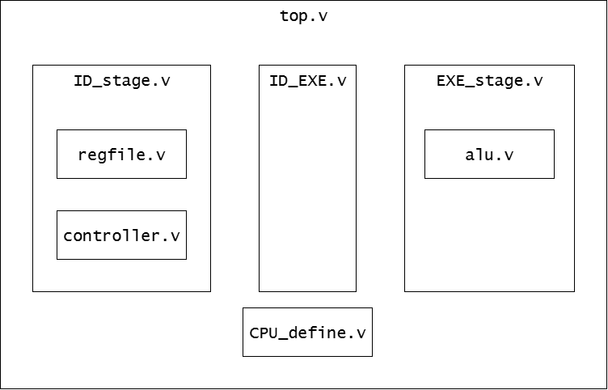
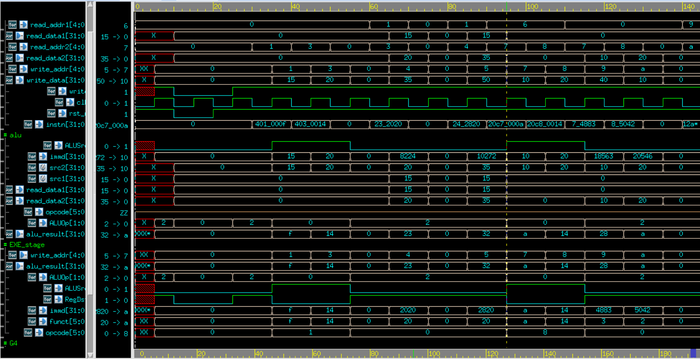

# Lab4-1
## 3-stage pipeline CPU


### ID_stage
```verilog
// read CPU_intro.pdf for definition.
assign rs_addr = instn[25:21];
assign rt_addr = instn[20:16];
assign rd_addr = instn[15:11];
assign shamt   = instn[10:6];
assign funct   = instn[5:0];
assign immd    = {{16{instn[15]}}, instn[15:0]};

regfile regfile(
    ...
);

controller controller(
    ...
);
```

### regfile
32 32-bit general purpose register with 5-bit address.
If control signal `Regwrite` is high, then read 2 data and write 1 data. Else, read two data.
```verilog
  else if(write) begin
    gpr[write_addr] <= write_data;
    read_data1 <= gpr[read_addr1];
    read_data2 <= gpr[read_addr2];
  end else begin
    read_data1 <= gpr[read_addr1];
    read_data2 <= gpr[read_addr2];
  end
```

### controller
Depend on the instruction, generate the control signal.
```verilog
always@* begin
  opcode = instn[31:26];
end

always@* begin
  case(opcode)
    Rtype: begin
      RegDst   = 1'b1;
      ALUOp    = 2'b10;
      ALUSrc   = 1'b0;
      RegWrite = 1'b1;
    end
    ...
    endcase
end
```

### ID_EXE
Just a pipeline register used to pass the signal from ID-stage to EXE-stage.

### EXE_stage
ALU execution stage.

## Testbench
### instruction.txt
Input instruction pattern.
```
000001_00000_00001_0000000000001111    // SET R1=15
000001_00000_00011_0000000000010100    // SET R3=20
000000_00000_00000_00000_00000_000000  // NOP
000000_00001_00011_00100_00000_100000  // ADD R4 = R3+R1
000000_00000_00000_00000_00000_000000  // NOP
000000_00001_00100_00101_00000_100000  // ADD R5 = R4+R1
001000_00110_00111_0000000000001010    // ADDI R7 = R6 + 10
001000_00110_01000_0000000000010100    // ADDI R8 = R6 + 20
000000_00000_00111_01001_00010_000011  // SLL R9 = R7<<2
000000_00000_01000_01010_00001_000010  // SRL R10 = R8>>1
000000_00000_00000_00000_00000_000000  // NOP
000000_01001_01010_00001_00000_100010  // SUB R1 = R9-R10
000000_01001_01010_00010_00000_100100  // AND R2 = R9 & R10
000000_01001_01010_00011_00000_100101  // OR  R3 = R9 | R10
000000_01001_01010_00100_00000_101000  // XOR R4 = R9 ^ R10
```
### golden_register.pat
The golden data, which is the ideal value of general purpose register(`gpr`).
```
00000000 //r0
0000001e //r1
00000008 //r2
0000002a //r3
00000023 //r4
00000032 //r5
00000000 //r6
0000000a //r7
00000014 //r8
00000028 //r9
0000000a //r10
...
```
### register.txt
The simulation value of `gpr` will be capture in this file. Belowing shows the first simulation for un-revised lab file.
```
gp           0 :           x| xxxxxxxx !!! Incorrect !!!
gp           1 :           x| xxxxxxxx !!! Incorrect !!!
gp           2 :           x| xxxxxxxx !!! Incorrect !!!
gp           3 :           x| xxxxxxxx !!! Incorrect !!!
gp           4 :           x| xxxxxxxx !!! Incorrect !!!
gp           5 :           x| xxxxxxxx !!! Incorrect !!!
gp           6 :           x| xxxxxxxx !!! Incorrect !!!
gp           7 :           x| xxxxxxxx !!! Incorrect !!!
```

## Bug fix
### Bug1
`ID_stage.v` didn't set `rst_n` for `regfile`.
```verilog
regfile regfile(
  .clk(clk),
  .rst_n(),
  .read_addr1(rs_addr),
  ...
);
```

### Bug2
`EXE_RegWrite` didn't get `ID_RegWrite` in `ID_EXE`.
```verilog
always@(posedge clk or negedge rst_n) begin
  if(~rst_n) begin
    EXE_opcode   <= 6'd0;
    ...
    EXE_ALUSrc   <= 1'b0;
  end
  else begin
    EXE_opcode   <= ID_opcode;
    ...
    EXE_RegDst   <= ID_RegDst;
    EXE_RegWrite <= 0;//ID_RegWrite;
    EXE_ALUOp    <= ID_ALUOp;
    EXE_ALUSrc   <= ID_ALUSrc;
  end
end
```

### Bug3
`EXE_stage`
```verilog
alu alu(
  // input
  .read_data1(0),
  .read_data2(read_data2),
  .immd(immd),
  .opcode(opcode),
  .funct(funct),
  .shamt(shamt),
  .ALUOp(ALUOp),
  .ALUSrc(ALUSrc),
  // output
  .alu_result(alu_result),
  .alu_overflow(alu_overflow),
  .zero(zero)
);
```

### Bug4 
`alu.v`
```verilog
      else if(funct==ADD) begin
        alu_result = src1 * src2;
      end
      else if(funct==SUB) begin
        alu_result = src1 + src2;
      end
```

## Simulation waveform
