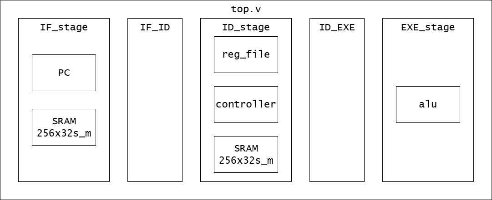
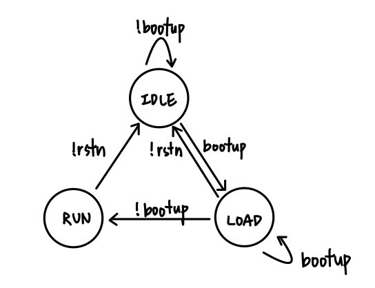
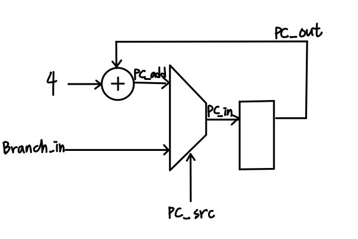

# Lab5: RTL simulation and debugging

## Description 
In Lab4 we have finished most parts of ID and EXE stages of CPU, left IF stage for 
manual, and ignored caches. In this lab, we will construct the instruction fetch function 
and cache blocks for our CPU, and complete the overall system. 



## Module function

### top
Connect the submodule `IF_stage`, `IF_ID`, `ID_stage`, `ID_EXE`, `EXE_stage`.

-----
### IF_stage
Connect `PC` and `SRAM1`.
```verilog
PC PC(
	.clk(clk),
	.rst_n(rst_n),
  .boot_up(boot_up),
	.PCSrc(PCSrc),
	.PC_out(PC_add), // output
  .PC_run(PC_run),   // output
	.Branch_in(Branch_in)
);

wire icache_en_wr = PC_run ? 1'b1 : boot_web;
wire [7:0] icache_addr = PC_run ? ins_addr : boot_addr;


/* instantiate SRAM256x32s as icache here
 *   The I port of icache should take boot_datai as input
 * The O port of icache should drive instn for CPU as instruction
 * The read/write control signal is controlled by icache_en_wr
 */
SRAM256x32s SRAM1(
	.CE(clk),
	.WEB(icache_en_wr), // write enable, active low
	.OEB(1'b0),			// output enable, active low
	.CSB(1'b0),			// chip select, active low
	.A(icache_addr),
	.I(boot_datai),
	.O(instn)
);
```

### PC(Program Counter)
This module has two part, finite state machine of boot-up, and program counter.

When the boot-up is complete, `PC_run` will pull high.

The program counter is shown as following.


### SRAM
Single port, can read or write 1 32-bit word per cycle. 
Store 256 32-bit word.
|OEB | CSB| WEB| operation |
|-|-|-|-|
|1| 0| 0| write|
|0| 0| 1| read|

-----
### IF_ID
A pipeline register pass the instruction and PC value.

-----
### ID_stage
```verilog
// read CPU_intro.pdf for definition.
assign rs_addr = instn[25:21];
assign rt_addr = instn[20:16];
assign rd_addr = instn[15:11];
assign shamt   = instn[10:6];
assign funct   = instn[5:0];
assign immd    = {{16{instn[15]}}, instn[15:0]};

regfile regfile(
    ...
);

controller controller(
    ...
);
```

### regfile
32 32-bit general purpose register with 5-bit address.
If control signal `Regwrite` is high, then read 2 data and write 1 data. Else, read two data.
```verilog
  else if(write) begin
    gpr[write_addr] <= write_data;
    read_data1 <= gpr[read_addr1];
    read_data2 <= gpr[read_addr2];
  end else begin
    read_data1 <= gpr[read_addr1];
    read_data2 <= gpr[read_addr2];
  end
```

### controller
Depend on the instruction, generate the control signal.
```verilog
always@* begin
  opcode = instn[31:26];
end

always@* begin
  case(opcode)
    Rtype: begin
      RegDst   = 1'b1;
      ALUOp    = 2'b10;
      ALUSrc   = 1'b0;
      RegWrite = 1'b1;
    end
    ...
    endcase
end
```

## instruction set
```verilog
000001_00000_00001_0000000000001111   // SET R1=15 
000001_00000_00011_0000000000010100   // SET R3=20
000000_00000_00000_00000_00000_000000 // NOP
000000_00001_00011_00100_00000_100000 // ADD R4 = R3+R1 = 35
000000_00000_00000_00000_00000_000000 // NOP
000000_00001_00100_00101_00000_100000 // ADD R5 = R4+R1 = 50
000000_00000_00000_00000_00000_000000 // NOP
101011_00000_00101_0000000000000010   // SW R5->0x2
000000_00000_00000_00000_00000_000000 // NOP
100011_00000_00110_0000000000000010   // LW 0x2->R6 = 50
000000_00000_00000_00000_00000_000000 // NOP
001000_00110_00111_0000000000001010   // ADDI R7 = R6 + 10 = 60
001000_00110_01000_0000000000010100   // ADDI R8 = R6 + 20 = 70
000000_00000_00111_01001_00010_000011 // SLL R9 = R7<<2 = 15
000000_00000_01000_01010_00001_000010 // SRL R10 = R8>>1 = 140
101011_00000_00111_0000000000000010   // SW R7->0x2
101011_00000_01000_0000000000000100   // SW R8->0x4
101011_00000_01001_0000000000000110   // SW R9->0x6
101011_00000_01010_0000000000001000   // SW R10->0x8
100011_00000_00001_0000000000000010   // LW 0x2->R1
100011_00000_00010_0000000000000100   // LW 0x4->R2
100011_00000_00011_0000000000000110   // LW 0x6->R3
100011_00000_00100_0000000000001000   // LW 0x8->R4
000000_01001_01010_00101_00000_100010 // SUB R5 = R9-R10
000000_01001_01010_00110_00000_100100 // AND R6 = R9 & R10
000000_01001_01010_00111_00000_100101 // OR  R7 = R9 | R10
000000_01001_01010_01000_00000_100101 // OR  R8 = R9 | R10
000000_00000_00000_00000_00000_000000 // NOP
000000_00000_00000_00000_00000_000000 // NOP
000000_01000_01010_00111_00000_100010 // SUB R7 = R8-R10
000000_00001_00011_00100_00000_100000 // ADD R4 = R3+R1
000000_01000_01010_00101_00000_100010 // SUB R5 = R8-R10
```

## action 1 implementation
### IF_stage
```verilog
/* instantiate SRAM256x32s as icache here
 *   The I port of icache should take boot_datai as input
 * The O port of icache should drive instn for CPU as instruction
 * The read/write control signal is controlled by icache_en_wr
 */
SRAM256x32s icache(
	.CE(clk),
	.WEB(icache_en_wr), // write enable, active low
	.OEB(1'b0),			// output enable, active low
	.CSB(1'b0),			// chip select, active low
	.A(icache_addr),
	.I(boot_datai),
	.O(instn)
);
```

### ID_stage SRAM
```verilog
/* Instantiate SRAM256x32s as dcache here
 * The I port of dcache should take CPU's arithmatic result as input
 * The O port of dcache should drive the data port from sram to CPU
 * The read/write control signal depends on whether CPU is going to read/write the SRAM
 */

SRAM256x32s dcache(
	.CE(clk),
	.WEB(!MemWrite),    // write enable, active low
	.OEB(1'b0),			// output enable, active low
	.CSB(1'b0),			// chip select, active low
	.A(immd),
	.I(sw_data),
	.O(dsram_out)
);
```

### controller
The control signal is define as `cpu_support_material.pdf`, but note that this signal define is high active and the `SRAM` is low active. So that we need to `!MemWrite` for `SRAM`.
```verilog
  /////////////////////////
  //More operation
  /////////////////////////
    `LW: begin
        RegDst = 1'b0;
        ALUOp = 2'b10;
        ALUSrc = 1'b1;
        branch = 1'b0;
        MemRead = 1'b1;
        MemWrite = 1'b0;
        RegWrite = 1'b1;
        MemtoReg = 1'b1;
    end
    `SW: begin
        RegDst = 1'b0;
        ALUOp = 2'b00;
        ALUSrc = 1'b1;
        branch = 1'b0;
        MemRead = 1'b0;
        MemWrite = 1'b1;
        RegWrite = 1'b0;
        MemtoReg = 1'b0;
    end
```

## action 2 implementation
```verilog
module controller (...)

always@* begin
  case(opcode)
    ...
    `BEQ: begin
        RegDst = 1'b0;
        ALUOp = 2'b01;
        ALUSrc = 1'b0;
        branch = 1'b1;
        MemRead = 1'b0;
        MemWrite = 1'b0;
        RegWrite = 1'b0;
        MemtoReg = 1'b0;
    end
    endcase
    ...
end
...
always @(*) begin
  case (state)
  NORMAL: begin
    if (opcode != BEQ) begin
      next_state = NORMAL;
      beq_enable = 1'b0;
    end else begin
      next_state = BEQ_IN;
      beq_enable = 1'b1;
    end
  end
  BEQ_IN: begin
    if (PCSrc != 1'b1) begin
      next_state = NORMAL;
      beq_enable = 1'b0;
    end else begin
      next_state = EQUAL;
      beq_enable = 1'b1;
    end
  end
  EQUAL: begin
    next_state = NORMAL;
    beq_enable = 1'b0;
  end
  endcase
end
endmodule
```
### branch taken example
The `beq_enable` will flush the instruction in `IF_ID` pipeline register.
|cycle|IF|ID|EXE|state|`beq_enable`|
|-|-|-|-|-|-|
|0|BEQ|||NORMAL|0|
|1|ins2|BEQ||BEQ_IN|1|
|2|ins3|nop|BEQ|EQUAL|1|
|3|target|nop|nop|NORMAL|0|

### branch not taken example
May occurs error(`ins2` been flush), so the first instruction follows `BEQ` must be `nop`.
|cycle|IF|ID|EXE|state|`beq_enable`|
|-|-|-|-|-|-|
|0|BEQ|||NORMAL|0|
|1|ins2|BEQ||BEQ_IN|1|
|2|ins3|nop|BEQ|NORMAL|0|
|3|ins4|ins3|nop|NORMAL|0|