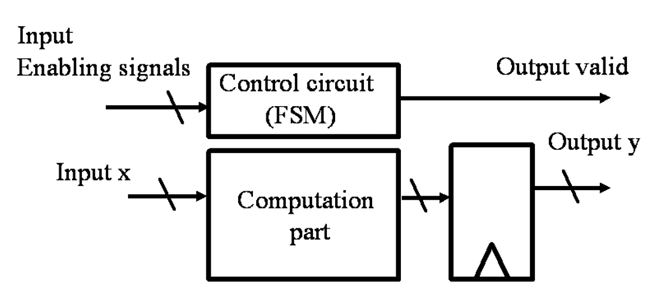
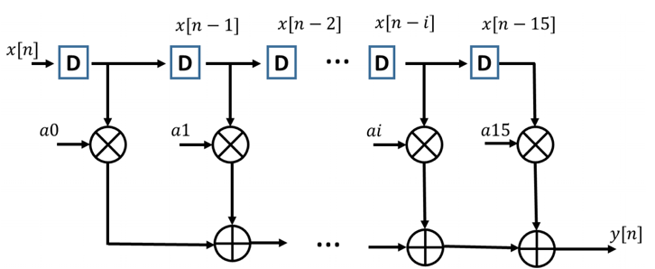

# Lab6-2
## FIR filter
### top-level block

To simplify the design, the finite state machine is provided to decide whether the output is valid. 
You only need to finish the computational part.

### computation block

### fir1
|Area | Timing | Cycle | Performence |
|- |-|-|-|
|8985|5.2383|1|$2.12 \times 10^{-5}$|

$\text{Performence} = \frac{1}{8985\times5.2383}=2.12\times 10^{-5}$

### fir_pipeline
### fir1
|Area | Timing | Cycle | Performence |
|- |-|-|-|
|8985|5.2383|1|$2.12 \times 10^{-5}$|

$\text{Performence} = \frac{1}{8985\times5.2383}=2.12\times 10^{-5}$