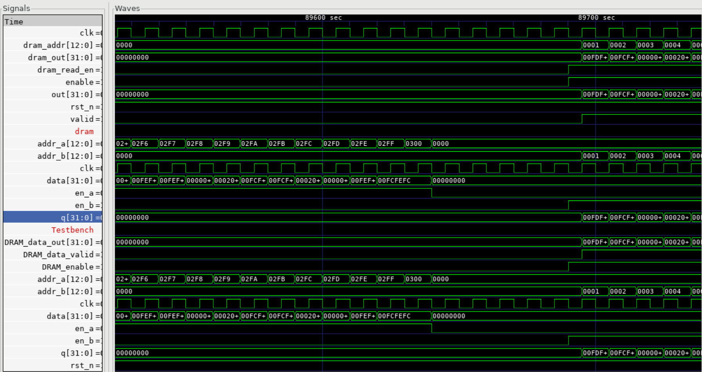
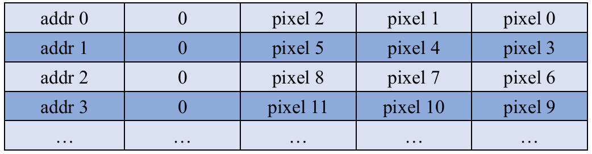
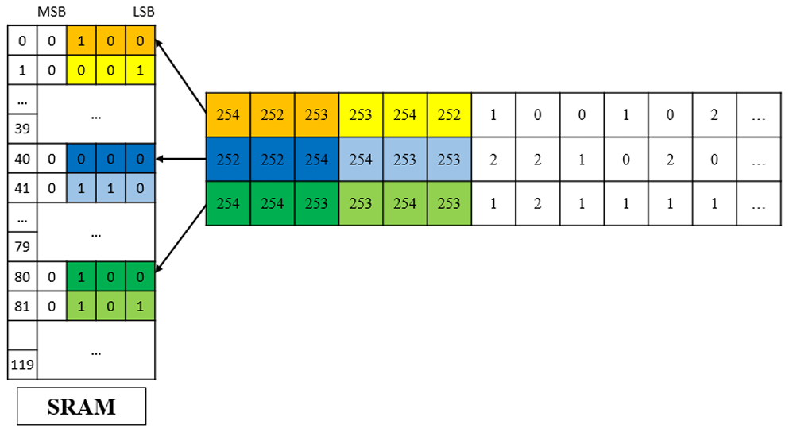
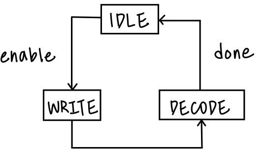
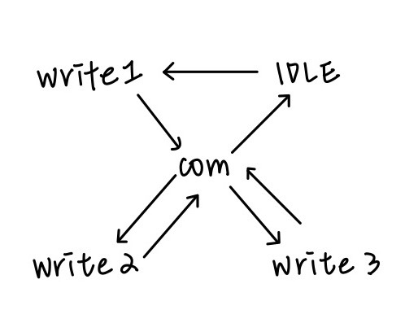
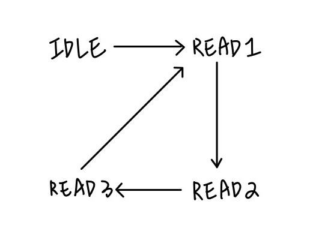
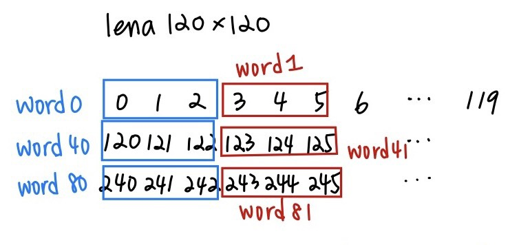
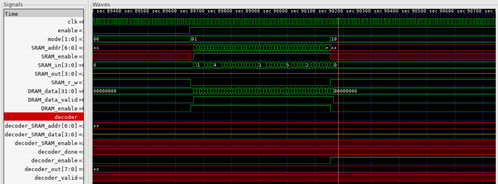
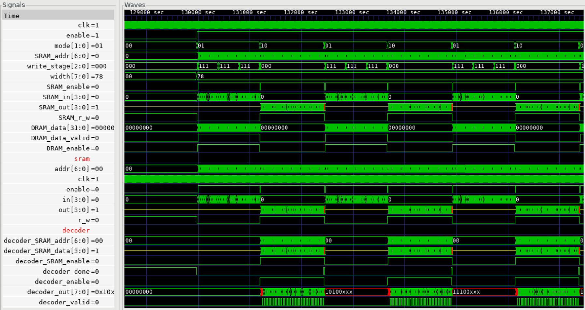

# Lab7: Line-based Image Processing
Author: Jesse
## Part1: Understand DRAM behavior

### DRAM module
`two_port_ram_sclk.v`: dram module
1 port wite, 1 port read. 
The data will read and write by one cycle.

The storage size is 32*2^13 bit.
```verilog
module two_port_ram_sclk
#
(
  parameter DATA_WIDTH = 32,
  parameter ADDR_WIDTH = 13
)
(
  input clk,
  // Port A for write
  input en_a, // write enable
  input [ADDR_WIDTH-1:0] addr_a, // write address
  input [DATA_WIDTH-1:0] data, // write data
  // Port B for read
  input en_b, // read enable
  input [ADDR_WIDTH-1:0] addr_b, // read address
  output reg [DATA_WIDTH-1:0] q // read data
);
```
### DRAM controller
`dram_read_controller.v`: dram controller
Simply pass the enable to dram, and pass the output of dram to testbench. When the 
`enable == 1`, start the address counter, then give the address to dram.

### test_dram.v
phase1: keep write zero to whole dram.

phase2: write data(24-bit) into dram, note that the bit-width of dram is 32-bit.


phase3: read data from dram.

## Part2:  Access SRAM and decode messages
### SRAM module
single port SRAM. Can only read or write one data in one cycle.

The storage size is 4*2^7 = 4\*128 = 128 word(4-bit/word). 

Only the LSB of each pixel is useful to find the secret message. 

For example, 48x48 chess have 48*48 pixels, if three pixels use 1 SRAM word, 48 pixels use 16 SRAM words. The largese image in this lab is 120x120 lena, each row use 120 pixels, 40 SRAM words.

Since the memory space is not enough to store the whole LSBs of an image, we can only store at most 3 rows of data from DRAM. We can read DRAM 1 times 
and combine LSBs of 3 pixels to get a 3-bit data and then write it to SRAM. 

The SRAM access rules is as following: **Store the data from the first row of image at SRAM address 0 to 39, the 
second row at address 40 to 79, and the third row at address 80 to 119**. 


```verilog
module SRAM
#
(
  parameter DATA_WIDTH = 4,
  parameter ADDR_WIDTH = 7
)
(
  input clk,
  input enable, // read/write enable
  input r_w, // r_w==0:write, r_w==1:read
  input [DATA_WIDTH-1:0] in, // input data
  input [ADDR_WIDTH-1:0] addr, // address
  output reg [DATA_WIDTH-1:0] out // output data
);
```

### steganography
This module contains `decoder` and `sram`, control the workflow with two fsm.



The first fsm divide the workflow into three step.

Step1: steganography is `IDLE`, the host-side is loading data into dram or do nothing.

Step2: After loading dram, part of data need to sweep to sram, so writing the data from dram to sram.

Step3: The decoder will read the data from sram to decode the message.



The next fsm is for step2, used to generate the address of sram access.

```
sram address: 
0 (write1)
1 (compute)
2 (compute)
... +1 (compute)

jump to 40 (write2)
41 (compute)
42 (compute)
... + 1 (compute)

jump t0 80 (write3)
81 (compute)
82 (compute)
... +1 (compute)

```

### Decoder

After written data into sram, in step3 decode, trigger the `decoder`, it will read the sram and decode the data.

The readign address of sram is generate by the flolling fsm.



There is a base-address counter will count up every three cycle. We define other two address as: 

```
base-address   = base-address 
second-address = base-address + 40
third-address  = base-address + 80
```

In `READ1` the sram address choose `base-address`. In `READ2` the sram address choose `second-address`. In `READ3` the sram address choose `third address`.

The three reading data wil be store in the data-buffer and then decode, give the output to the testbench and pull up the valid. 



After decode all of the data in the sram, the `done` will pull up, so the first fsm will back to `IDLE` and `WRITE`, rewrite the `SRAM` by next three row of data.


### test_sram.v
phase1: keep write zero to whole dram.

phase2: write data(24-bit) into dram, note that the bit-width of dram is 32-bit.

phase3: read data from dram to sram.

phase4: check answer after written 3 row of data in dram to sram. For example, the `width` means the number of pixel for a image, 120x120 lena, `width=120`, use 40 sram word to store a row of 120 data. When we store 3 row, 360 data, 120 sram word, the address of `sram_address == width`, which is equals to the following code in the testbench.
```verilog
wait(u_dram_controller.address === width); // wait dram read three rows
```



### test_top.v

phase1: keep write zero to whole dram.

phase2: write data(24-bit) into dram, note that the bit-width of dram is 32-bit.

phase3: trigger the steganography.



The wave form is interleave by write sram and decode process.