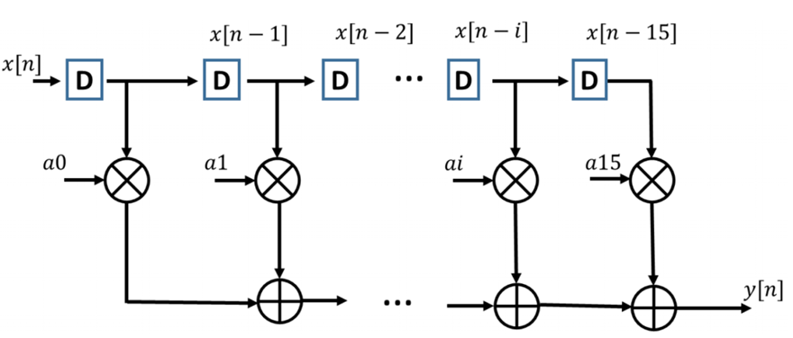
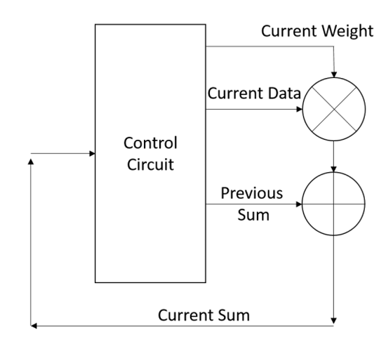
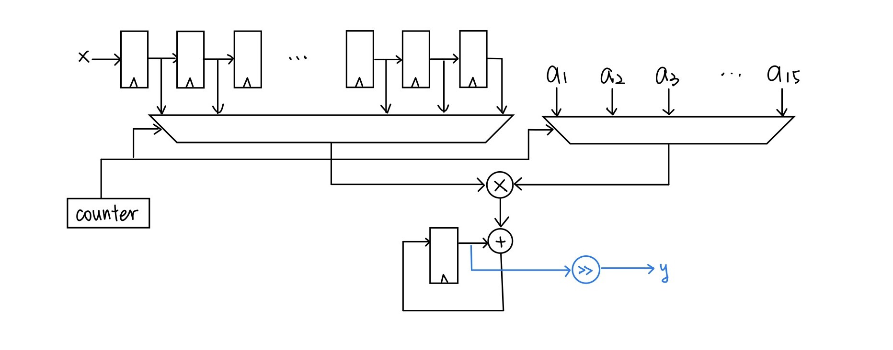
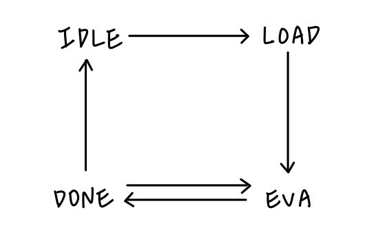
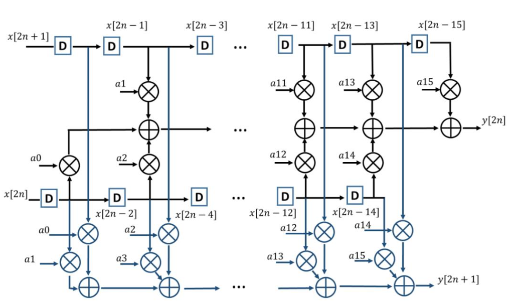
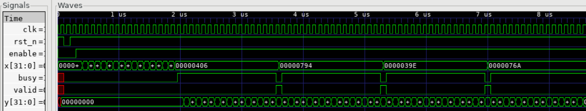
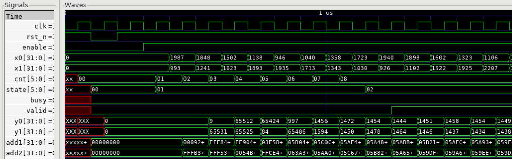

# Lab8: Coding for Synthesis

This lab implement a fir filter with two different architecture from lab6.

## 1. One multiplier and one adder architecture

## 2. Parallel architecture

## 3. Performance Comparison

| Module | Area | Timing | Cycles(#) | Performance |
| ------ | ---- | ------ | --------- | ----------- |
| one_add_mul | 7566|2.27 |167480 | $ 3.47\times 10^{-10}$ | 
| parallel |23539 | 3.2| 5040| $2.63\times 10^{-9}$| 
| direct | 12912|3.3 | 10050 | $ 2.34\times 10^{-9}$ | 
| pipeline |15345 | 2.5| 10070| $2.58\times 10^{-9}$| 
$ \text{Performance} = \frac{1}{A\times T \times C} $

The performance of parallel architecture is better.

one_add_mul use the minimum resource.

parallel has the better throughput and cycle.

pipeline have better timing.

### Part1 waveform

### PArt2 waveform

## 4. Resource report

### parallel
code 32 mul, 30 add.
datapath report 32 mul, 30 add.
no resource sharing.

### one_add_mul
code 1 mul, 1 add.
datapath report 1 mul, 1 add.
no resource sharing
