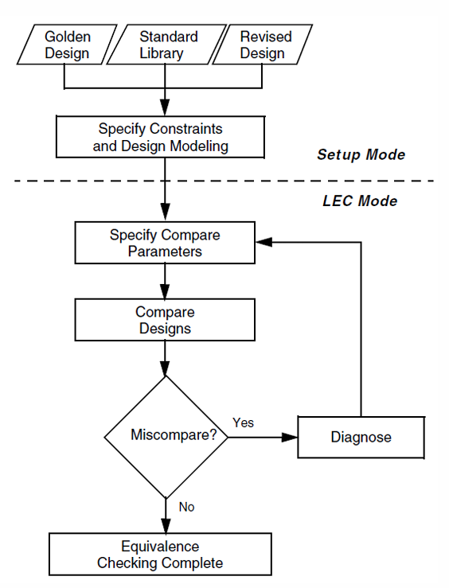

# Lab9: Logic Equivalence Checking

In previous labs, we have synthesized our RTL design. However, we haven’t checked 
the correctness of the synthesized result. Rather than directly do the gate-level 
simulation, we adopt the conformal tool LEC to check the logic equivalence between 
our RTL design and the synthesized netlist. Note that, we can also use the same tool to 
check the logic equivalence between synthesized netlist with P&R’s result.

In this lab, we use candance tool **Conformal** to do LEC.

```shell
# file architecture

lab9
/lab09_part1
--/lec          # logic equivalence check environment
-----/0_lec_setup.do         # read in + setup mode
-----/0_lec_compare.do       # lec mode
-----/0_lec_all.do           # do 0_lec_setup.do + 0_lec_compare.do
-----/1_lec_hier_compare.do  # multi-use the setup to the submodule and do the compare process for each submodule
-----/1_lec_hier_all.do      # do 0_lec_setup.do + 1_lecl_hier_compare.do 
-----/golden.f               # source rtl code
-----/revised.f              # synthesis netlist
-----/run_lec.sh
--/model        # dram, sram model
--/netlist      # synthesis generate netlist
--/sim          # pre-sim enviroment
--/source       # rtl source code
/lab09_part2
```

## Lab9-1: Conformal check with LEC

### Introduction to LEC



#### 1. Design read in
We define **golden design** and **revised design**.

The golden design may be your rtl code or the synthesis netlist.

The revised design may be your netlist or netlist after ECO.

The two compare pair may be:
1. source rtl-code vs synthesis netlist
2. synthesis netlist vs netlist after ECO

#### 2. Library read in

Read Liberty or behavior HDL models for standard cells and macros.
**Conformal** needs these models to understand the logical behavior
of gates and library cells.

#### 3. Setup mode
Describe how the design is actually used, and how some structural
differences should be treated as equivalent.

1. Constraint specification: E.g. fix input pin, ignore output pin– 
2. Design modeling: E.g. Model special implementation styles such as clock gating,
scan cells, loops, etc., so structural differences do not
cause false non-equivalence.

 #### 4. LEC mode
Compare the two designs on well-defined “check points”.

1. Mapping process (for key points): <br>Match primary inputs/outputs, register outputs, and
black-box pins between golden and revised designs.
These matched nodes are called key points.

2. Analyze process (for datapath): <br>Recognize and simplify large datapath structures
(adders, multipliers, DesignWare blocks, etc.)
to reduce aborts and make the proof easier.

3. Compare process: <br>Formally prove, for every key point pair, that the golden
and revised values are always equivalent under all legal
inputs and constraints.

If all key points are equivalent, the two designs are
considered functionally equivalent.

#### 5. Flatten comparison & Hierarchical comparison

1. Flatten (top-level) comparison <br>Scripts: 0_lec_setup.do + 0_lec_compare.do (or 0_lec_all.do). <br>Flow: after setup, Conformal directly compares the whole top module ($TOP_DESIGN) in one shot. This is simple and works well for small
designs, and is used as the basic LEC flow in Lab9.

2. Hierarchical (module-based) comparison<br>
   Scripts: `0_lec_setup.do` + `1_lec_hier_compare.do` (wrapped by `1_lec_hier_all.do`).  
   `0_lec_setup.do` builds the environment once (design read-in, black-box
   settings, renaming rules, clock-gating / seq-constant modeling).  
   `1_lec_hier_compare.do` uses `write hier_compare` to automatically generate
   a dofile that:
   - partitions the design by module, and  
   - for each module runs the same analyze sequence (`analyze setup`,
     `analyze multiplier`, `analyze datapath`) before `compare`, then
     `analyze abort -compare` afterwards.  
   `run hier_compare hier.do` performs a dynamic hierarchical compare:
   errors in lower modules are not hidden; they propagate up to the top
   result, making LEC more scalable and easier to debug on larger designs.


In summary, the flat flow checks the whole top at once, while the hierarchical
flow reuses the same modeling/analyze steps on each module partition to
provide finer-grained, scalable verification.

#### 6. Black-box macros in LEC

In this lab, memory macros such as `dsram` are treated as **black boxes**:

- We use  
  `add notranslate module dsram -library -both`  
  in `0_lec_setup.do` to mark `dsram` as a black box on both golden and
  revised sides.
- Conformal does **not** expand the internal logic of `dsram`; instead,
  all its inputs and outputs become **key points** for comparison.
- This has two main benefits:  
  (1) we avoid blowing up the LEC problem on large macros, and  
  (2) we guarantee that any mismatch in how the macro is connected
      (address/data/control pins) will be reported by LEC.

#### 7-1. Flat Compare Question
##### 1. Find out how many key points are mapped: 
PI: 44; PO: 33; DFF: 1284; BBOX: 2; Total: 1363

##### 2. There are 35 unreachable(unmapped) points in the RTL(Golden). Is this OK? 
Yes, since synthesis will remove unused flip-flop bit(optimize), so the synthesis netlist may different to source rtl-code 

##### 3. There are additional 132 unreachable points for DLAT (latch) in the netlist(Revised), Why?. 
since the gated clock is implement by latch to avoid glitch, so there is a latch in the netlist.

##### 4. How many key points are compared and claimed equivalent? 
* 1319

#### 7-2 Hierarchical Compare Question

##### 5. How many modules are compared separately? 
* 6

## Lab9-2: ECO-Integer Division

Since in real design, you can always change the design(for example, after APR). If you find the error, you need to redesign the circuit, but didn't admit new synthesis circuit, you can only correct the netlist with sparse cell.

In this lab, we correct the inverse table, so we also need to correct the synthesis netlist from original design by ECO, and use LEC to check this new netlist to new design, check there function is same.
 
```verilog
// original
5'd31 : div_inverse = 17'd67652 ;
// revised
5'd31 : div_inverse = 17'd67651 ;
```